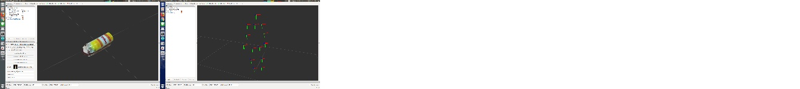
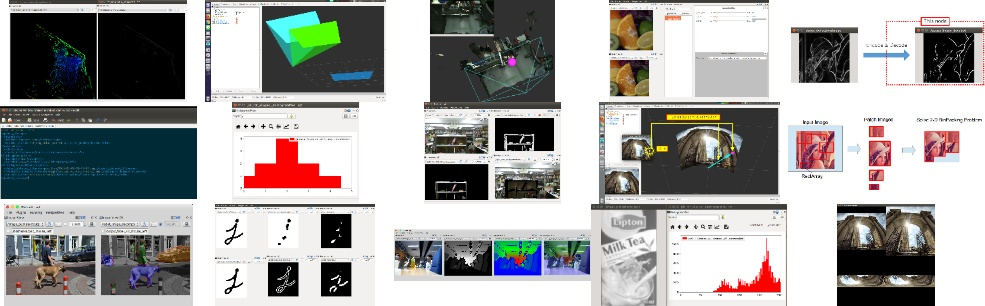
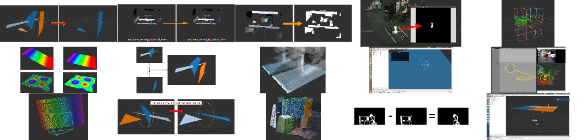
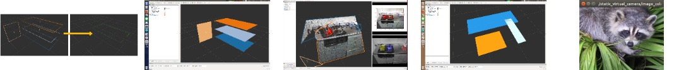
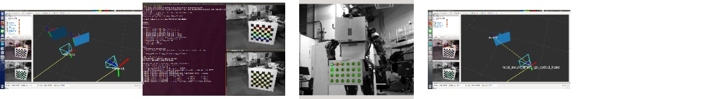
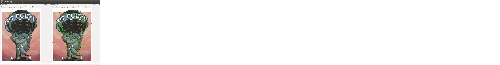

<!--
    DO NOT EDIT THIS FILE BY HAND.

    This file is automatically generated by /home/shingo/ros/kinetic/src/jsk-ros-pkg/jsk_recognition/generate_readme.py at 2019-10-18T18:52:30.818076.
-->

jsk\_recognition
===============

jsk_recognition is a stack for the perception packages which are used in JSK lab.

ROS packages
------------

| Package                 | Description                                           | Documentation                                                                                                                                             | Code                                                                                                                                             |
|:------------------------|:------------------------------------------------------|:----------------------------------------------------------------------------------------------------------------------------------------------------------|:-------------------------------------------------------------------------------------------------------------------------------------------------|
| jsk_recognition_msgs    | ROS messages for jsk_pcl_ros and jsk_perception.      |     |     |
| jsk_perception          | ROS nodes and nodelets for 2-D image perception.      |           |           |
| jsk_pcl_ros             | ROS nodelets for pointcloud perception.               |              |              |
| jsk_pcl_ros_utils       | ROS utility nodelets for pointcloud perception.       |        |        |
| resized_image_transport | ROS nodes to publish resized images.                  |  |  |
| jsk_recognition_utils   | C++ library about sensor model, geometrical modeli... |    |    |
| checkerboard_detector   | Uses opencv to find checkboards and compute their ... |    |    |
| imagesift               | For every image, computes its sift features and se... |                |                |

Gallery
-------

### [jsk_recognition_msgs](https://jsk-docs.readthedocs.io/projects/jsk_recognition/en/latest/jsk_recognition_msgs)

### [jsk_perception](https://jsk-docs.readthedocs.io/projects/jsk_recognition/en/latest/jsk_perception)

### [jsk_pcl_ros](https://jsk-docs.readthedocs.io/projects/jsk_recognition/en/latest/jsk_pcl_ros)

### [jsk_pcl_ros_utils](https://jsk-docs.readthedocs.io/projects/jsk_recognition/en/latest/jsk_pcl_ros_utils)

### [resized_image_transport](https://jsk-docs.readthedocs.io/projects/jsk_recognition/en/latest/resized_image_transport)

### [jsk_recognition_utils](https://jsk-docs.readthedocs.io/projects/jsk_recognition/en/latest/jsk_recognition_utils)

### [checkerboard_detector](https://jsk-docs.readthedocs.io/projects/jsk_recognition/en/latest/checkerboard_detector)

### [imagesift](https://jsk-docs.readthedocs.io/projects/jsk_recognition/en/latest/imagesift)

Deb build status
----------------

[//]: # (!!DO NOT EDIT !!)

[//]: # (THIS SECTION IS AUTOMATICALLY GENERATED BY)

[//]: # (rosrun jsk_tools generate_deb_status_table.py jsk_recognition)

| Package                 | Kinetic (Xenial)                                                                                                                                                                                           | Melodic (Bionic)                                                                                                                                                                                           | Noetic (Bionic)                                                                                                                                                                                            |
|:------------------------|:-----------------------------------------------------------------------------------------------------------------------------------------------------------------------------------------------------------|:-----------------------------------------------------------------------------------------------------------------------------------------------------------------------------------------------------------|:-----------------------------------------------------------------------------------------------------------------------------------------------------------------------------------------------------------|
| jsk_recognition (arm64) |  |  |  |
| jsk_recognition (armhf) |  |  |  |
| jsk_recognition (i386)  |              | ---                                                                                                                                                                                                        | ---                                                                                                                                                                                                        |
| jsk_recognition (amd64) |            |            |            |

[//]: #

Deprecated packages
-------------------
* [cr\_calibration](https://github.com/jsk-ros-pkg/jsk_recognition/tree/master/cr_calibration)
* [cr\_capture](https://github.com/jsk-ros-pkg/jsk_recognition/tree/master/cr_capture)
* [orbit\_pantilt](https://github.com/jsk-ros-pkg/jsk_recognition/tree/master/orbit_pantilt)
* [posedetectiondb](https://github.com/jsk-ros-pkg/jsk_recognition/tree/master/posedetectiondb)
* [jsk\_libfreenect2](https://github.com/jsk-ros-pkg/jsk_recognition/tree/master/jsk_libfreenect2)
