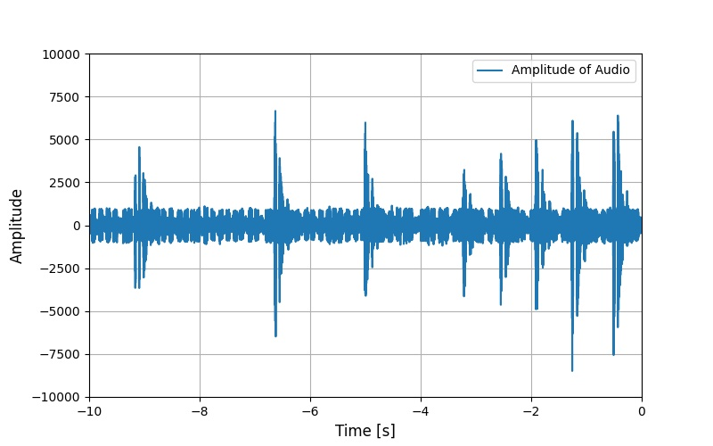

# audio_to_spectrogram

This package converts audio data (or other time-series data) to spectrum and spectrogram data.

# Usage
By following command, you can publish audio, spectrum and spectrogram topics. Please set correct args for your microphone configuration, such as mic\_sampling\_rate or bitdepth.

```bash
roslaunch audio_to_spectrogram audio_to_spectrogram.launch
```

Its data conversion pipeline is as follows:
```
audio_to_spectrum.py -> spectrum
                     -> normalized_half_spectrum
                     -> log_spectrum             -> preprocess node(s) -> preprocessed spectrum -> spectrum_to_spectrogram.py -> spectrogram
```

Here is an example using rosbag with 300Hz audio.
```bash
roslaunch audio_to_spectrogram sample_audio_to_spectrogram.launch
```

|Audio Amplitude|Spectrum|Spectrogram|
|---|---|---|
||||

You can also convert data other than audio to spectrum and spectrogram data using this package.  
Here is an example using rosbag of a force torque sensor sensing drill vibration.
```bash
roslaunch audio_to_spectrogram sample_wrench_to_spectrogram.launch
```

|Z-axis Force Amplitude|Normalized Half Spectrum|Spectrogram Source Spectrum|Spectrogram|
|---|---|---|---|
|||||

# Scripts

## audio_to_spectrum.py

  A script to convert audio to spectrum.

  - ### Publishing topics
    - `~spectrum` (`jsk_recognition_msgs/Spectrum`)

      Spectrum data calculated from audio by FFT.  
      It is usual "amplitude spectrum".  
      See https://ryo-iijima.com/fftresult/ for details.

    - `~normalized_half_spectrum` (`jsk_recognition_msgs/Spectrum`)

      Spectrum data which is "half" (having non-negative frequencies (0Hz-Nyquist frequency)) and is "normalized" (consistent with the amplitude of the original signal).  
      See the following for details.
      - https://ryo-iijima.com/fftresult/
      - https://stackoverflow.com/questions/63211851/why-divide-the-output-of-numpy-fft-by-n
      - https://github.com/jsk-ros-pkg/jsk_recognition/issues/2761#issue-1550715400

    - `~log_spectrum` (`jsk_recognition_msgs/Spectrum`)

      Log-scaled spectrum data.  
      It is calculated by applying log to the absolute value of the FFT result.  
      Usually, log is applied to "power spectrum", but we don't use it for simplicity.  
      See the following for details.
      - https://github.com/jsk-ros-pkg/jsk_recognition/issues/2761#issuecomment-1445810380
      - http://makotomurakami.com/blog/2020/05/23/5266/

  - ### Subscribing topics
    - `~audio` (`audio_common_msgs/AudioData`)

      Audio stream data from microphone. The audio format must be `wave`.

  - ### Parameters
    - `~mic_sampling_rate` (`Int`, default: `16000`)

      Sampling rate [Hz] of microphone. Namely, sampling rate of audio topic.

    - `~fft_sampling_period` (`Double`, default: `0.3`)

      Period [s] to sample audio data for one FFT.

    - `~n_channel` (`Int`, default: `1`)

      Number of channel of microphone.

    - `~target_channel` (`Int`, default: `0`)

      Target channel.

    - `~bitdepth` (`Int`, default: `16`)

      Number of bits per audio data.

    - `~fft_exec_rate` (`Double`, default: `50`)

      Rate [Hz] to execute FFT and publish its results.

## data_to_spectrum.py

  Generalized version of `audio_to_spectrum.py`.  
  This script can convert multiple message types to spectrum.

  - ### Publishing topics

    Same as `audio_to_spectrum.py`.

  - ### Subscribing topics
    - `~input` (`AnyMsg`)

      Topic to which message including data you want to convert to spectrum is published.

  - ### Parameters
    - `~expression_to_get_data` (`String`, default: `m.data`)

      Python expression to get data from the input message `m`. For example, if your input is `std_msgs/Float64`, it is `m.data`.  
      Just accessing a field of `m` is recommended.  
      If you want to do a complex calculation (e.g., using `numpy`), use `transform` of `topic_tools` before this node.

    - `~data_sampling_rate` (`Int`, default: `500`)

      Sampling rate [Hz] of input data.

    - `~fft_sampling_period` (`Double`, default: `0.3`)

      Period [s] to sample input data for one FFT.

    - `~fft_exec_rate` (`Double`, default: `50`)

      Rate [Hz] to execute FFT and publish its results.

    - `~is_integer` (`Bool`, default: `false`)

      Whether input data is integer or not. For example, if your input is `std_msgs/Float64`, it is `false`.

    - `~is_signed` (`Bool`, default: `true`)

      Whether input data is signed or not. For example, if your input is `std_msgs/Float64`, it is `true`.

    - `~bitdepth` (`Int`, default: `64`)

      Number of bits per input data. For example, if your input is `std_msgs/Float64`, it is `64`.

    - `~n_channel` (`Int`, default: `1`)

      If your input is scalar, it is `1`.  
      If your input is flattened 2D matrix, it is number of channel of original matrix.

    - `~target_channel` (`Int`, default: `0`)

      If your input is scalar, it is `0`.  
      If your input is flattened 2D matrix, it is target channel.

## spectrum_filter.py

  A script to filter spectrum.

  - ### Publishing topics
    - `~output` (`jsk_recognition_msgs/Spectrum`)

      Filtered spectrum data (`low_cut_freq`-`high_cut_freq`).

  - ### Subscribing topics
    - `~input` (`jsk_recognition_msgs/Spectrum`)

      Original spectrum data.

  - ### Parameters
    - `~data_sampling_rate` (`Int`, default: `500`)

      Sampling rate [Hz] of data used in generation of original spectrum data.

    - `~high_cut_freq` (`Int`, default: `250`)

      Threshold to limit the maximum frequency of the output spectrum.

    - `~low_cut_freq` (`Int`, default: `0`)

      Threshold to limit the minimum frequency of the output spectrum.

## spectrum_to_spectrogram.py

  A script to convert spectrum to spectrogram.

  - ### Publishing topics
    - `~spectrogram` (`sensor_msgs/Image`)

      Spectrogram data, which is concatenation of spectrum in time series. Image format is 32FC1.

  - ### Subscribing topics
    - `~spectrum` (`jsk_recognition_msgs/Spectrum`)

      Spectrum data calculated from audio by FFT.

  - ### Parameters
    - `~image_height` (`Int`, default: `300`)

      Number of vertical (frequency axis) pixels in output spectrogram.

    - `~image_width` (`Int`, default: `300`)

      Number of horizontal (time axis) pixels in output spectrogram.

    - `~spectrogram_period` (`Double`, default: `5`)

      Period [s] to store spectrum data to create one spectrogram topic.

    - `~publish_rate` (`Double`, default: `image_width / spectrogram_period`)

      Publish rate [Hz] of spectrogram topic.

## audio_amplitude_plot.py

  A script to publish audio amplitude plot image.


  - ### Publishing topics

    - `~output/viz` (`sensor_msgs/Image`)

      Audio amplitude plot image.

  - ### Subscribing topics

    - `~audio` (`audio_common_msgs/AudioData`)

      Audio stream data from microphone. The audio format must be `wave`.

  - ### Parameters
    - `~mic_sampling_rate` (`Int`, default: `16000`)

      Sampling rate [Hz] of microphone. Namely, sampling rate of audio topic.

    - `~n_channel` (`Int`, default: `1`)

      Number of channel of microphone.

    - `~target_channel` (`Int`, default: `0`)

      Target channel.

    - `~bitdepth` (`Int`, default: `16`)

      Number of bits per audio data.

    - `~maximum_amplitude` (`Double`, default: `10000.0`)

      Maximum range of amplitude to plot.

    - `~window_size` (`Double`, default: `10.0`)

      Window size of sound input to plot.

    - `~rate` (`Double`, default: `10.0`)

      Publish rate [Hz] of audio amplitude image topic.

## data_amplitude_plot.py

  Generalized version of `audio_amplitude_plot.py`.

  - ### Publishing topics

    - `~output/viz` (`sensor_msgs/Image`)

      Data amplitude plot image.

  - ### Subscribing topics
    - `~input` (`AnyMsg`)

      Topic to which message including data whose amplitude you want to plot is published.

  - ### Parameters
    - `~expression_to_get_data` (`String`, default: `m.data`)

      Python expression to get data from the input message `m`. For example, if your input is `std_msgs/Float64`, it is `m.data`.  
      Just accessing a field of `m` is recommended.  
      If you want to do a complex calculation (e.g., using `numpy`), use `transform` of `topic_tools` before this node.

    - `~data_sampling_rate` (`Int`, default: `500`)

      Sampling rate [Hz] of input data.

    - `~is_integer` (`Bool`, default: `false`)

      Whether input data is integer or not. For example, if your input is `std_msgs/Float64`, it is `false`.

    - `~is_signed` (`Bool`, default: `true`)

      Whether input data is signed or not. For example, if your input is `std_msgs/Float64`, it is `true`.

    - `~bitdepth` (`Int`, default: `64`)

      Number of bits per input data. For example, if your input is `std_msgs/Float64`, it is `64`.

    - `~n_channel` (`Int`, default: `1`)

      If your input is scalar, it is `1`.  
      If your input is flattened 2D matrix, it is number of channel of original matrix.

    - `~target_channel` (`Int`, default: `0`)

      If your input is scalar, it is `0`.  
      If your input is flattened 2D matrix, it is target channel.

    - `~maximum_amplitude` (`Double`, default: `10.0`)

      Maximum range of amplitude to plot.

    - `~window_size` (`Double`, default: `10.0`)

      Window size of input data to plot.

    - `~rate` (`Double`, default: `10.0`)

      Publish rate [Hz] of data amplitude image topic.

## spectrum_plot.py

  A script to publish frequency vs amplitude plot image.


  - ### Publishing topics

    - `~output/viz` (`sensor_msgs/Image`)

      Frequency vs amplitude plot image.

  - ### Subscribing topics

    - `~spectrum` (`jsk_recognition_msgs/Spectrum`)

      Spectrum data calculated from audio by FFT.

  - ### Parameters
    - `~min_amp` (`Double`, default: `0.0`)

      Minimum value of amplitude in plot.

    - `~max_amp` (`Double`, default: `20.0`)

      Maximum value of amplitude in plot.

    - `~queue_size` (`Int`, default: `1`)

      Queue size of spectrum subscriber.

    - `~max_rate` (`Double`, default: `-1`)

      Maximum publish rate [Hz] of frequency vs amplitude plot image. Setting this value low reduces CPU load. `-1` means no maximum limit.
