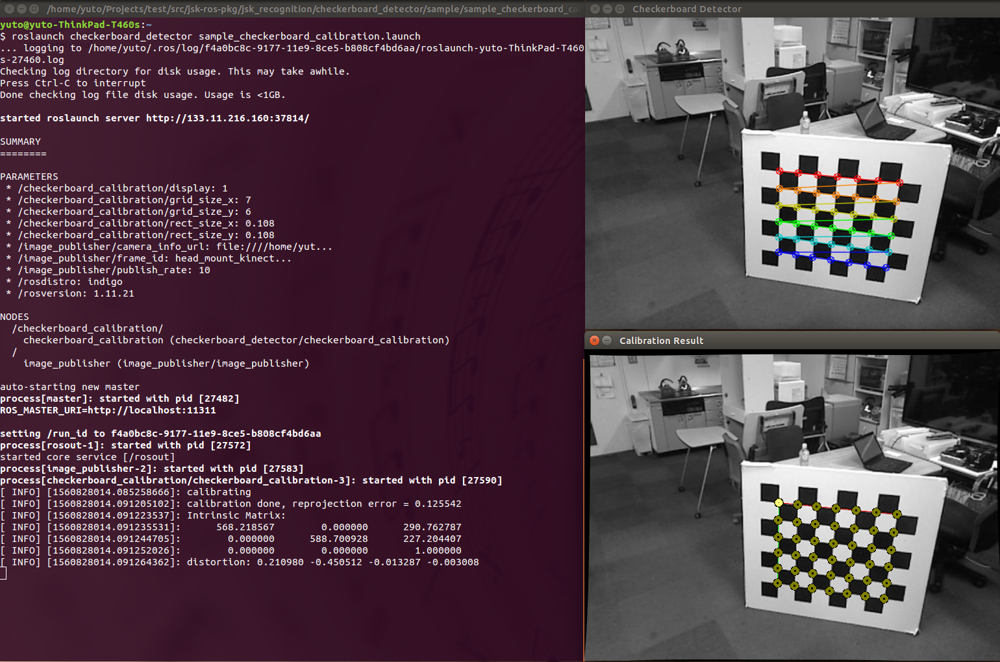

checkerboard_calibration
========================



What is this?
-------------

A ROS node for calibrating camera intrinsic parameter by using checker board.
You can find marker pattern in [jsk-ros-pkg/calibboard_sheet](https://github.com/jsk-ros-pkg/calibboard_sheet).
This node only supports chess board pattern.

You can click mouse middle button at either image window and then get calibration result as `ROS_INFO`.
Also, you can clear current calibration data by clicking mouse right button at either window.

Please consider using [camera_calibration](http://wiki.ros.org/camera_calibration) package.


Subscribing Topics
------------------

* `image` (`sensor_msgs/Image`)

  Input image for calibration.
  The image assumed to be `image_raw`, which means it is not rectified.

* `Image` (`sensor_msgs/Image`)

  Deprecated.


Publishing Topics
-----------------

None.


Parameters
----------
* `display` (`Int`, default: `1`)

  Set `1` to show viewer (not `image_view` but OpenCV window).

* `grid_size_x` (`Int`, required)
* `grid_size_y` (`Int`, required)

  The number of grids along x and y axis.

* `rect_size_x` (`Float`, required)
* `rect_size_y` (`Float`, required)

  Size of checkerboard in meters.


Sample
------

```bash
roslaunch checkerboard_detector sample_checkerboard_calibration.launch
```
