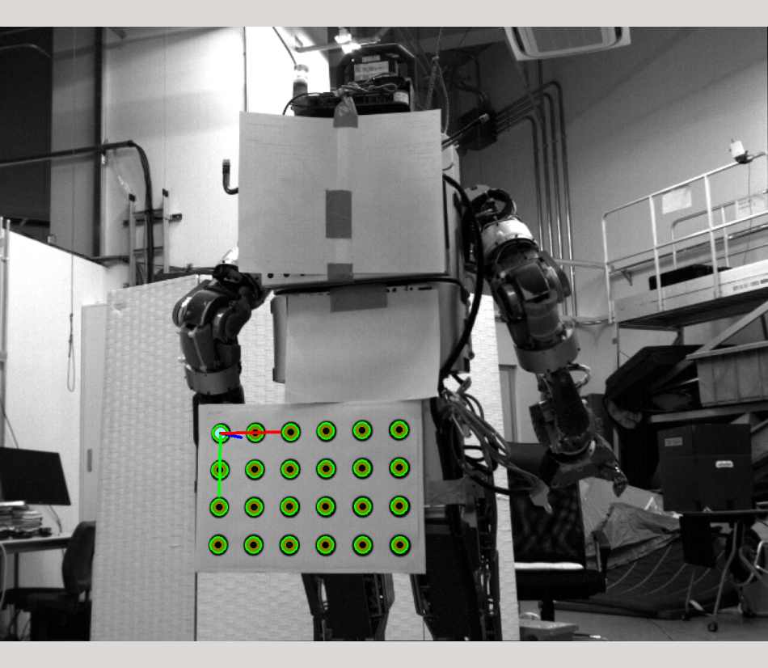

checkerboard_detector
=====================


`checkerboard_detector` is an executable to detect checker board.
You can find marker pattern in [jsk-ros-pkg/calibboard_sheet](https://github.com/jsk-ros-pkg/calibboard_sheet).


Subscribing Topics
------------------
* `image` (`sensor_msgs/Image`)
* `camera_info` (`sensor_msgs/CameraInfo`)

  Input image and camera info. Intrinsic camera parameter is
  acquired from `camera_info`.

* `Image` (`sensor_msgs/Image`)
* `CameraInfo` (`sensor_msgs/CameraInfo`)

  These topics are deprecated.


Publishing Topics
-----------------
* `ObjectDetection` (`posedetection_msgs/ObjectDetection`)
* `objectdetection_pose` (`geometry_msgs/PoseStamped`)

  Pose of checkerboard in `posedetection_msgs/ObjectDetection` and `geometry_msgs/PoseStamped`.

* `corner_point` (`geometry_msgs/PointStamped`)

  Corner points.

* `polygons` (`jsk_recognition_msgs/PolygonArray`)

  Publish checker board as `jsk_recognition_msgs/PolygonArray`. It is useful to visualize in rviz.

* `debug_image` (`sensor_msgs/Image`)

  Debug image showing detected checker board.


Parameters
----------
* `display` (`Int`, default: `0`)

  Set `1` to enable debug view (not `image_view` but OpenCV window).
  Note that `debug_image` is published even when this parameter is set to `0`.

* `board_type` (`String`, default: `chess`)

  Type of marker. `chess`, `circle`, `circles`, `acircle` and `acircles` are supported.
  `circle` and `circles` are the same, and also `acircle` and `acircles` are.

* `rect%d_size_x` (`Float`, required)
* `rect%d_size_y` (`Float`, required)

  Size of checkerboard in meters, where `%d` means index of checker board starting from `0`.

* `grid%d_size_x` (`Int`, required)
* `grid%d_size_y` (`Int`, required)

  The number of grids along x and y axis.

* `type%d` (`String`, default: `checker%dx%d`)

  Name of checker board written to `objects/type` field in `ObjectDetection` topic.

* `maxboard` (`Int`, default: `-1`)

  Maximum number of checker board.
  `-1` means infinity, so this node wil detect as much as possible.

* `use_P` (`Bool`, default: `false`)

  By default, use camera matrix (K) and unrectified image (image_raw).
  If you use rectified image (image_rect), `use_P` should be `true`.

* `invert_color` (`Bool`, default: `false`)

  Invert white and black before searching cross points or circles.

* `message_throttle` (`Int`, default: `1`)

  Finding checker boards every `message_throttle` images

* `frame_id` (`String`, default: `""`)

  Frame ID written to `ObjectDetection` topic header.
  If empty string is specified, frame_id of `image` topic will be used.

* `queue_size`         (`Int`, default: `1`)
* `publish_queue_size` (`Int`, default: `1`)

  Size of queue of subscriber is `queue_size`, publisher is `publish_queue_size`.

* `axis_size`   (`Float`, default: `0.05`)
* `circle_size` (`Int`, default: `6`)

  For setting displayed marker size.
  Set `circle_size` in [pixel].
  Set `axis_size` in [m].

* `verbose` (`Int`, default: `1`)

  Output information about input image, number of detected checker board
  and elapsed time as `ROS_INFO` if this parameter is greater than `0`.


Sample
------

```bash
roslaunch checkerboard_detector sample_checkerboard_detector.launch
```

Trouble Shooting
----------------
* Q. Estimated checker board pose is not correct

  A. First check debug image and all the detected corner points correctly superimposed on camera view.
  * If the detected corner points is **not correct**, you need to modify checker board grid size (`grid_size` parameters).
  * If the detected corner points is **correct**, confirm checker board size (`rect_size` parmaeters) and intrinsic camera paramter is calibrated well.

* Q. How many number of grids better?

  A. I strongly recomment to choose `odd`x`even` or `even`x`odd`. Because if you choose `odd`x`odd` or `even`x`even`,
  detector will have two potential poses.
