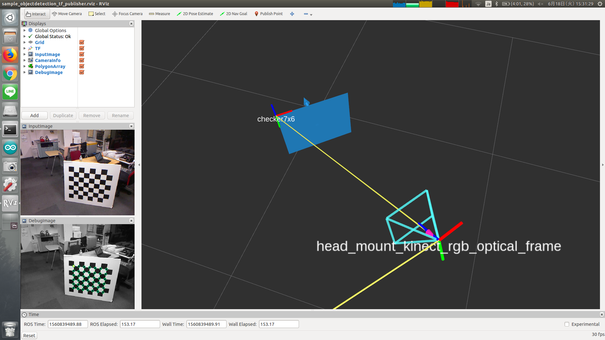

objectdetection_tf_publisher
============================



What is this?
-------------

Subscrive `posedetection_msgs/ObjectDetection` message and broadcast TF.


Subscribing Topics
------------------

* `ObjectDetection` (`posedetection_msgs/ObjectDetection`)

  Input object pose.


Publishing Topics
-----------------

* `/tf` (`tf2_msgs/TFMessage`)

  Object transform.


Parameters
----------

* `~use_simple_tf` (`Bool`, default: `False`)

  Whether to use `tf.TransformBroadcaster` or not.
  If false, this node will use [dynamic_tf_publisher](https://github.com/jsk-ros-pkg/jsk_common/tree/master/jsk_coordination_system/dynamic_tf_publisher)

Parameters below will be enabled only when `~use_simple_tf` is False.

* `~checker_board_params/header_frame` (`String`, required)

  Parent frame ID.

* `~frame_id` (`String`, default: `object`)

  Child frame ID.

* `~checker_board_params/position_x` (`Float`, default: `0.0`)
* `~checker_board_params/position_y` (`Float`, default: `0.0`)
* `~checker_board_params/position_z` (`Float`, default: `0.0`)
* `~checker_board_params/orientation_x` (`Float`, default: `0.0`)
* `~checker_board_params/orientation_y` (`Float`, default: `0.0`)
* `~checker_board_params/orientation_z` (`Float`, default: `0.0`)
* `~checker_board_params/orientation_w` (`Float`, default: `0.0`)

  Object pose.


Sample
------

```bash
roslaunch checkerboard_detector sample_objectdetection_tf_publisher.launch
```
