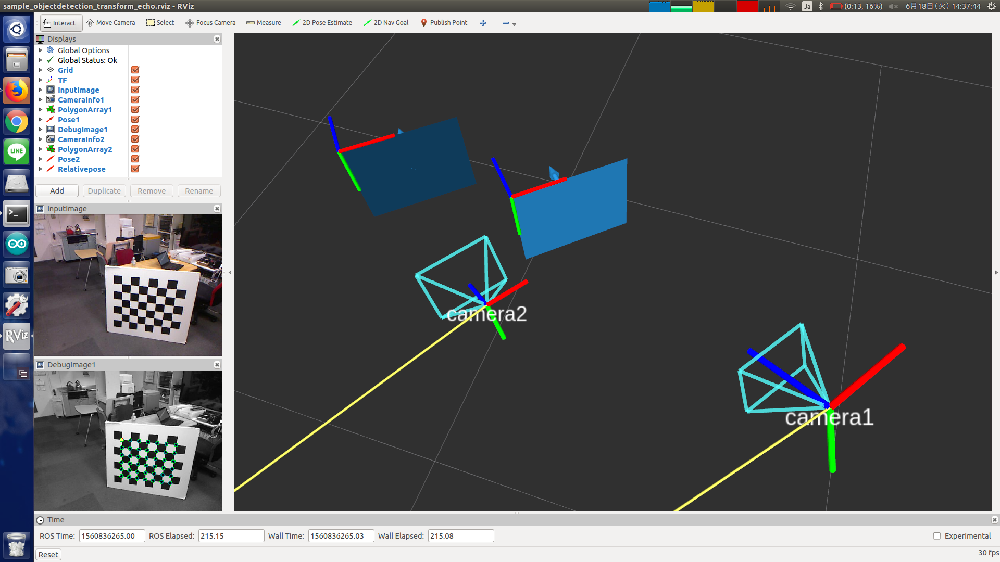

objectdetection_transform_echo
==============================



What is this?
-------------

Subscrive `posedetection_msgs/ObjectDetection` messages and get transform between them.

See also: [objectdetection_tf_publisher.py](objectdetection_tf_publisher.md)


Subscribing Topics
------------------

* `detection1` (`posedetection_msgs/ObjectDetection`)
* `detection2` (`posedetection_msgs/ObjectDetection`)

  Input object pose.
  This node will calculate pose from `detection2` to `detection1` at `frame_id` frame.


Publishing Topics
-----------------

* `pose` (`geometry_msgs/PoseStamped`)

  Transform between input poses.


Parameters
----------

* `frame_id` (`String`, default: `""`)

  Frame ID of `pose` topic.


Sample
------

```bash
roslaunch checkerboard_detector sample_objectdetection_transform_echo.launch
```
