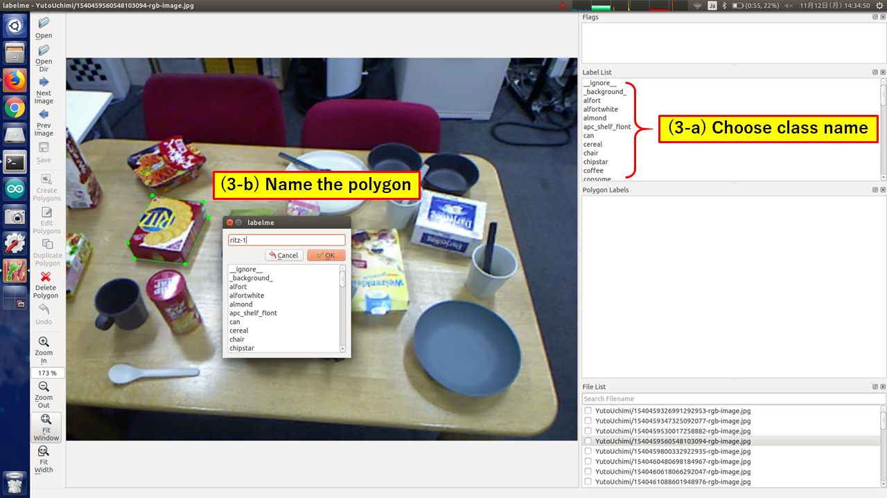
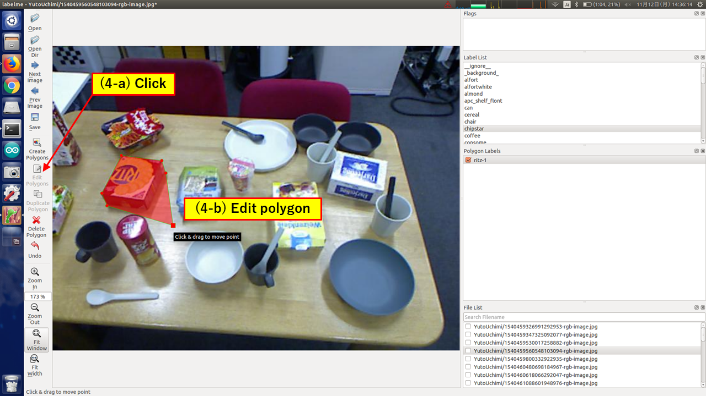
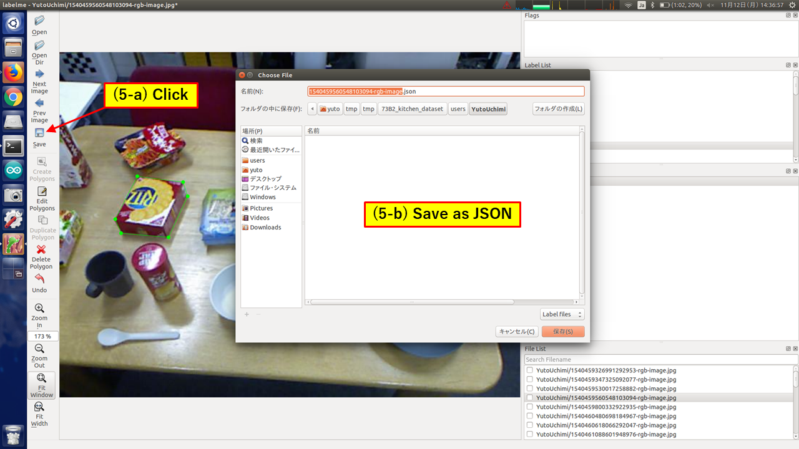

Annotate images with labelme
============================

This documentation describes how to annotate images with an annotation tool named labelme.

Install labelme
---------------

::

   pip install labelme

For more information, please see https://github.com/wkentaro/labelme

How to use labelme
------------------

Split your data
^^^^^^^^^^^^^^^

We recommend you to make ``train``, ``val`` and ``test`` directory, and split your image files into them.

Prepare label list
^^^^^^^^^^^^^^^^^^

List up all labels and save them into a file (e.g. labels.txt).

Note that "ignore" label must be described as ``__ignore__`` and "background" label as ``_background_``, and they must be placed in the first and second line respectively in labels.txt.

All labels must not have "-", because it is used to distinct instances.

Do annotation
^^^^^^^^^^^^^

1. First, open file with GUI.

::

   labelme [--labels labels.txt] [directory | file]

2. Click "Create Polygons" and draw polygons.

.. image:: images/annotate_images_with_labelme_1.png

3. Choose the class of the object from "Label List".

   If you would like to create dataset for instance segmentation, please remember to name the polygon ``<class name>-<instance id>``.

4. You can edit polygon by clicking "Edit Polygons"

5. When you have finished annotating all objects listed in "Label List" in the image, click "Save" to save .json file.

Create dataset
^^^^^^^^^^^^^^

After annotation, you can create dataset from raw images, labels and JSON files.

- For semantic segmentation, see https://github.com/wkentaro/labelme/tree/master/examples/semantic_segmentation

- For instance segmentation, see https://github.com/wkentaro/labelme/tree/master/examples/instance_segmentation

Store dataset
^^^^^^^^^^^^^

At last, place your dataset where you want.

For example, ``$HOME/.ros/data/jsk_perception/learning_datasets/awesome_dataset``. ::

  awesome_dataset
  |-- test
  |   |-- JPEGImages
  |   |-- SegmentationClass
  |   |-- SegmentationClassPNG
  |   |-- SegmentationClassVisualization
  |   |-- SegmentationObject
  |   |-- SegmentationObjectPNG
  |   |-- SegmentationObjectVisualization
  |   `-- class_names.txt
  `-- train
      |-- JPEGImages
      |-- SegmentationClass
      |-- SegmentationClassPNG
      |-- SegmentationClassVisualization
      |-- SegmentationObject
      |-- SegmentationObjectPNG
      |-- SegmentationObjectVisualization
      `-- class_names.txt
