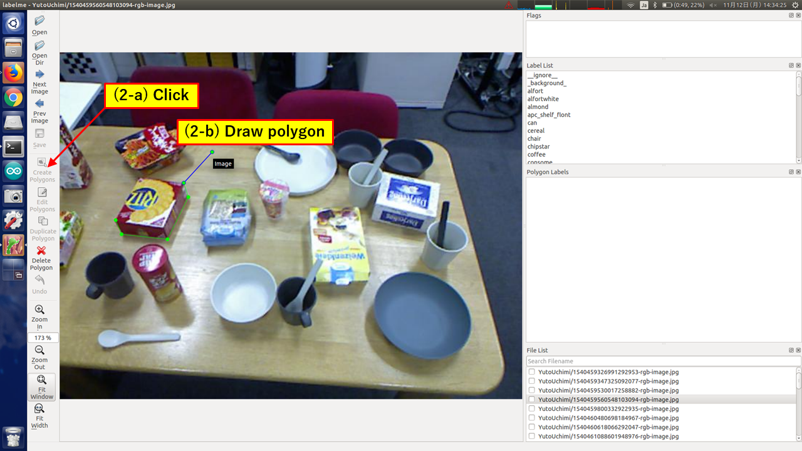

Annotate images with labelme
============================

This documentation describes how to annotate images with an annotation tool named labelme.

Install labelme
---------------

::

   pip install labelme

For more information, please see https://github.com/wkentaro/labelme

How to use labelme
------------------

Prepare label list
^^^^^^^^^^^^^^^^^^

List up all labels and save them into a file (e.g. labels.txt).

Note that "background" label must be described as "_background_", and all labels must not have "-".

Do annotation
^^^^^^^^^^^^^

1. First, open file with GUI.

::

   labelme [--labels labels.txt] [directory | file]

2. Click "Create Polygons" and draw polygons.

3. Choose the class of the object from "Label List".

   If you would like to create dataset for instance segmentation, please remember to name the polygon "<class name>-<instance id>".

.. image:: images/annotate_images_with_labelme_2.png

4. You can edit polygon by clicking "Edit Polygons"

5. When you have finished annotating all objects listed in "Label List" in the image, click "Save" to save .json file.

.. image:: images/annotate_images_with_labelme_4.png
