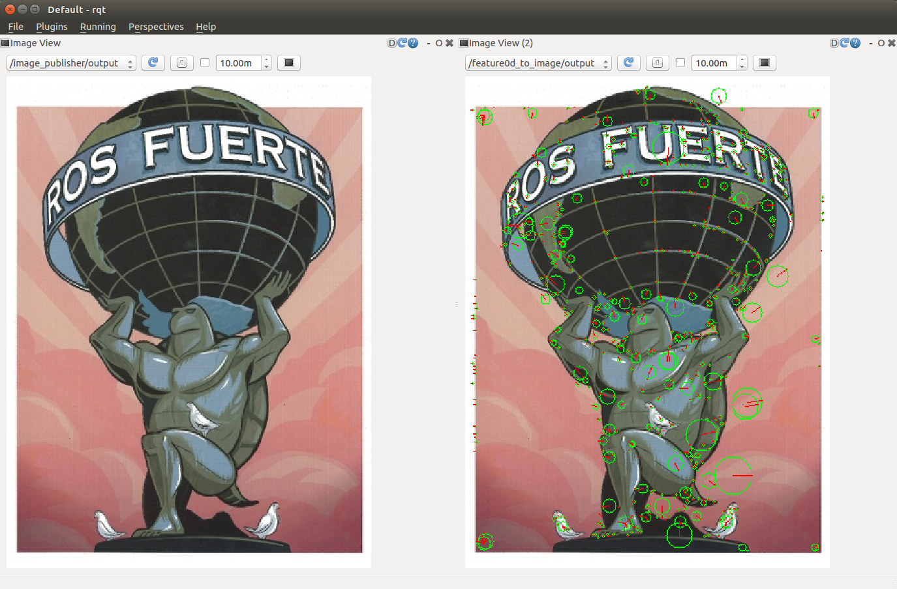

ImageSift
=========

Extract sift features from input image.

Subscribing Topic
-----------------

- ``image`` (``sensor_msgs/Image``)

   Input image. This triggers output ``Feature0D``.

-  ``camera_info`` (``sensor_msgs/CameraInfo``)

   Input camera_info.

Publishing Topic
----------------

-  ``Feature0D`` (``posedetection_msgs/Feature0D``)

   This appears with input ``image``.

-  ``ImageFeature0D`` (``posedetection_msgs/ImageFeature0D``)

   This appears with both inputs ``image`` and ``camera_info``.

Run
---
You can run executable like below::

    $ rosrun imagesift imagesift

Sample
------

::

    $ roslaunch imagesift imagesift_sample.launch
