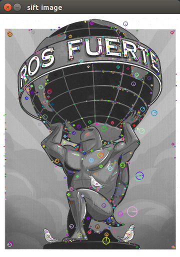

Extract SIFT and visualize keypoints.
=====================================

Sample is available at ``imagesift/sample/sift_keypoints.py``

.. code-block:: python

  # load image
  >>> from scipy.misc import lena
  >>> img = lena()  # gray-scale image

  >>> import imagesift

  # extract sift keypoints
  >>> frames, desc = imagesift.get_sift_keypoints(img)

  # draw keypoints on the image
  >>> out = imagesift.draw_sift_frames(img, frames)

  # view image with opencv2 window
  >>> import cv2
  >>> cv2.imshow('sift image', out)
  >>> cv2.waitKey(0)

You will get output like:

