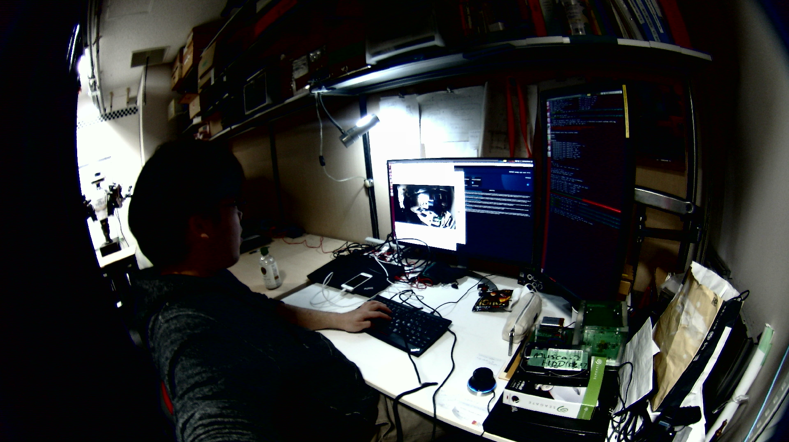

# Install ELP USB 4K camera

- ELP USB 4K camera: [http://www.webcamerausb.com](http://www.webcamerausb.com/elp-170-degree-fisheye-4k-usb-webcam-mjpeg-30fps-3840x2160-mini-cmos-usb-web-camera-with-microphone-for-desktoplaptop-pc-computer-p-296.html)
- libuvc_camera: [http://wiki.ros.org/libuvc_camera](http://wiki.ros.org/libuvc_camera)



## Install Udev

```bash
roscd jsk_perception
sudo cp udev/99-elp-usb-4k.rules /etc/udev/rules.d/
sudo service udev restart
```

## Sample

```bash
roslaunch jsk_perception sample_elp_usb_4k.launch
```
