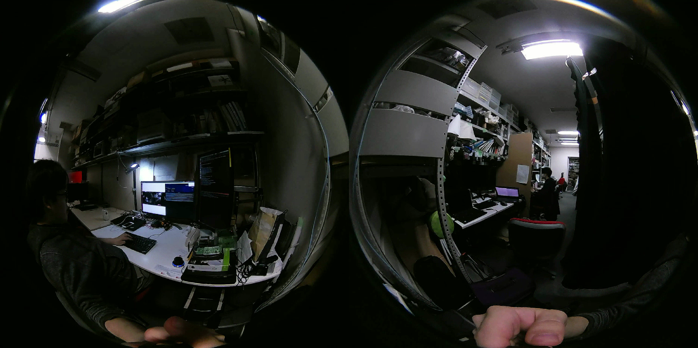

# Install Insta360 Air

- Insta360 Air:[https://www.insta360.com/jp/product/insta360-air](https://www.insta360.com/jp/product/insta360-air)
- libuvc_camera: [http://wiki.ros.org/libuvc_camera](http://wiki.ros.org/libuvc_camera)



## Install Udev

```bash
roscd jsk_perception
sudo cp udev/99-insta360-air.rules /etc/udev/rules.d/
sudo service udev restart
```

## Sample

```bash
roslaunch jsk_perception sample_insta360_air.launch
# For kinetic or lower
roslaunch jsk_perception sample_insta360_air.launch use_usb_cam:=true
```
