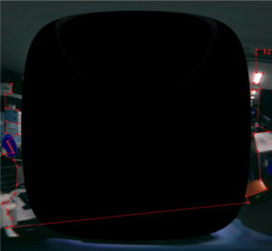
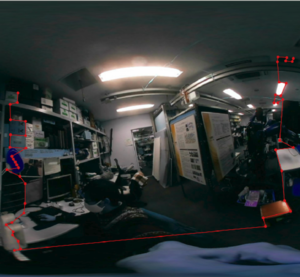

# Install Insta360 Air

- Insta360 Air:[https://www.insta360.com/jp/product/insta360-air](https://www.insta360.com/jp/product/insta360-air)
- libuvc_camera: [http://wiki.ros.org/libuvc_camera](http://wiki.ros.org/libuvc_camera)


## Install Udev

```bash
roscd jsk_perception
sudo cp udev/99-insta360-air.rules /etc/udev/rules.d/
sudo service udev restart
```

## Sample

```bash
roslaunch jsk_perception sample_insta360_air.launch
# For kinetic or lower
roslaunch jsk_perception sample_insta360_air.launch use_usb_cam:=true
# With rectified image
roslaunch jsk_perception sample_insta360_air.launch rectification:=true
# Calibration
roslaunch jsk_perception sample_insta360_air.launch gui:=false calibration:=true
```

## Update panorama parameter
This section describes how to update the panorama parameter for generating a panorama image.
1. Unwarp and save the left and right fisheye images. The images are `$HOME/.ros/l_img_crop.jpg` and `$HOME/.ros/r_img_crop.jpg`
```bash
roslaunch jsk_perception sample_insta360_air.launch use_usb_cam:=true save_unwarp:=true
```

2. Annotate the corresponding points of the left and right images. We use [labelme](https://github.com/wkentaro/labelme) as a GUI tool. `$HOME/.ros/l_img_crop.json` and `$HOME/.ros/r_img_crop.json` should be outputted.
```bash
sudo pip install labelme==4.5.7
labelme $HOME/.ros/l_img_crop.jpg
labelme $HOME/.ros/r_img_crop.jpg
```

  
  


3. Save the correspondence points to a matlab file.
```bash
rosrun jsk_perception create_mls_correspondence.py
```

4. Run `mls_rigid_example2.m` to generate the MLS grids file. matlab can be installed from the University of Tokyo license. You also need to install the image processing toolbox and the parallel computing toolbox.
Please check the [official wiki](https://github.com/drNoob13/fisheyeStitcher/wiki/How-to-create-the-MLS-%5BX,Y%5D-grids)

5. Convert the MLS grid file to a yaml file so that OpenCV can read it.
```bash
rosrun jsk_perception mls_matlab2opencv.py
```

6. Compress the yaml file to gz and place it under jsk_perception.
```bash
gzip ~/.ros/fisheye_stitcher_grid_xd_yd_3840x1920.yml
mv ~/.ros/fisheye_stitcher_grid_xd_yd_3840x1920.yml.gz $(rospack find jsk_perception)/config/fisheye_stitcher_grid_xd_yd_3840x1920.yml.gz
```
