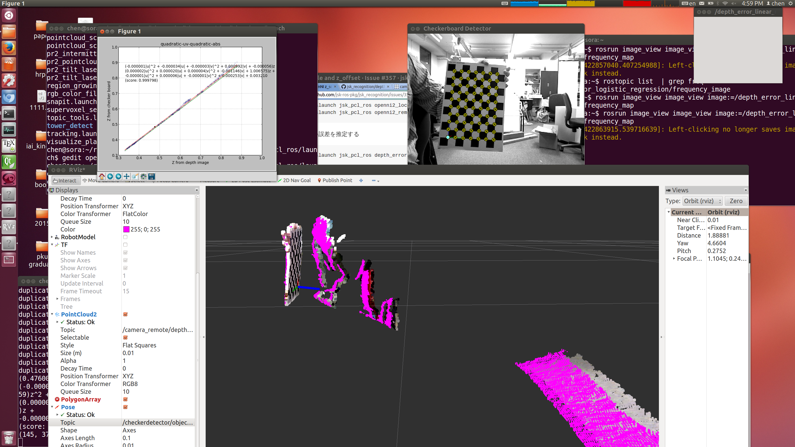
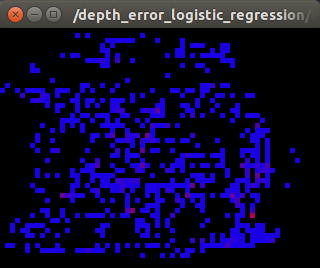

## Depth Camera Calibration(Kinect,Xtion,Primesense)

### Two Main Steps:

*  `1. Camera Intrisic Calibration: Intrisic Calibration` `Please refer to ros RGB camera calibration tutorial` >> [ros wiki](http://wiki.ros.org/camera_calibration/Tutorials/MonocularCalibration)

*  `2. Depth Calibration: Depth Calibration` related to the distance z, optical frame pixel u v and global pixel offset.

### You need:

*   Chessboard: Make sure ur Application Range, if u wanna use camera in short range(0.5m~2m) choose small chessboard, otherwise plz choose a larger one.
*   Depth Camera: Kinect one, Xtion, Primesense. (There may be some problem when using primesense, check [here](http://answers.ros.org/question/197318/openni2_launch-doesnt-work-with-carmine-109-connected-to-usb30/?comment=198397#comment-198397) to install the newest openni2, perhaps u need to do `apt-get remove libopenni2-0` first)
*   Good PC with ubuntu and ros installed:  We only tested in Lenovo thinkpad series.
*   jsk\_pcl\_ros:   [jsk package](ttps://github.com/jsk-ros-pkg/jsk_recognition/tree/master/jsk_pcl_ros)

### Camera Intrisic Calibration:

* Please follow [this](http://wiki.ros.org/camera_calibration/Tutorials/MonocularCalibration) tutorial and when u finished calibration(4 features become green), wait patiently until u can click upload, calibration file will be right there in `~/.ros/camera_info/***.yaml` waiting.  Check the `openni2_launch.launch` file or `openni2_local.launch` if u use JSK package to edit the path.

* For Details Please Refer to [this](http://citeseerx.ist.psu.edu/viewdoc/download;jsessionid=5A82FAA90B9414360C604CB73796CCD6?doi=10.1.1.220.534&rep=rep1&type=pdf)`Zhang, Zhengyou. "A flexible new technique for camera calibration." Pattern Analysis and Machine Intelligence, IEEE Transactions on 22.11 (2000): 1330-1334.`

### Depth Calibration(Available only in jsk\_pcl\_ros package):
We assume the intrisic calibration has been performed well.

* Plug in ur depth camera to your favourite USB port and run `roslaunch jsk_pcl_ros openni2_local.launch` and `roslaunch jsk_pcl_ros openni2_remote.launch` (Load the camera intrisic calibration file)

* Do `roscd jsk_pcl_ros` and `cd launch`, find file `depth_error.launch` and edit param `rect0_size_x` `rect0_size_y` and  `grid0_size_x` `grid0_size_y` according to your chessboard. Then `roslaunch jsk_pcl_ros depth_error.launch`

* Do `rosrun rviz rviz` and subscribe to 3 topics(two pointcloud2 and one Pose)

1. Pose `/checkerdetector/objectdetection_pose`

2. Raw Pointcloud `/camera_remote_uncalibrated/depth_registered/points`

3. Calibrated Pointcloud ``/camera_remote/depth_registered/points``

You will see the Error between Pose(Estimated by rbg camera while looking at chessboard) and uncalibrated
pointcloud.

* Open another Terminal and run `rosrun jsk_pcl_ros depth_error_calibration.py --model quadratic-uv-quadratic-abs` and move the chessboard slowly while watching to the image window. The edges of the image should be covered and the range(due to your application) should also be covered as more as possible.

* Open new Terminal and run `rosrun image_view image_view image:=/depth_error_logistic_regression/frequency_image`. You can observe which point the chessboard passes on the window. If it never apeears, setting `approximate_sync` in `jsk_pcl_ros/launch/depth_error.launch` to true might help you. (Please see the example below.)

```
  <node pkg="jsk_pcl_ros" type="depth_image_error"
        name="depth_image_error"
        output="screen">
    <remap from="~image" to="$(arg DEPTH_IMAGE)" />
    <remap from="~point" to="/checkerdetector/corner_point" />
    <remap from="~camera_info" to="$(arg CAMERA_INFO_TOPIC)" />
    <rosparam> 
      approximate_sync: true
    </rosparam>
  </node>
```


* Checking the window output and the Rviz output when you find the calibrated pointcloud overlaps the Pose vector. `Ctrl+c` in this Terminal and enter `y` to save the calibration file. Edit `openni2_remote.launch` file and find the param `depth_calibration_file`, add the path of your calibration file.

* Finish and Check it again.
