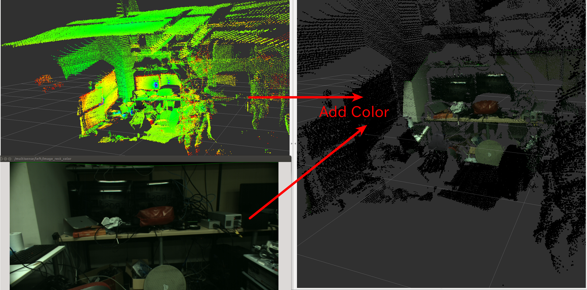

# AddColorFromImage


Add color to pointcloud (no need to be organized) from image and camera info.

## Subscribing Topic

* `~input` (`sensor_msgs/PointCloud2`)

  Input pointcloud to be colorized, which is not necessarily organized.

* `~input/image` (`sensor_msgs/Image`)

  Input image for the colors.

* `~input/camera_info` (`sensor_msgs/CameraInfo`)

  Input camera info.


## Publishing Topic

* `~output` (`sensor_msgs/PointCloud2`)

  Output colorized pointcloud.


## Sample

```
roslaunch jsk_pcl_ros add_color_from_image.launch
```
