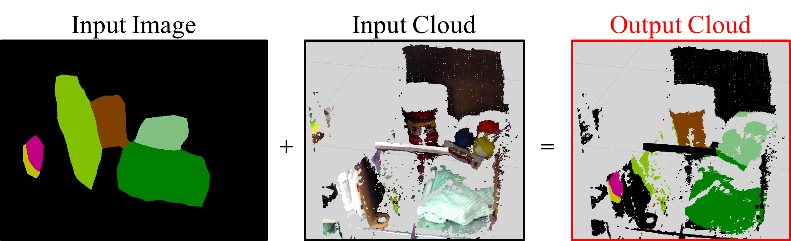

# AddColorFromImageToOrganized



Add color to organized pointcloud from image. Use AddColorFromImage for unorgnized pointcloud.

## Subscribing Topic

* `~input` (`sensor_msgs/PointCloud2`)

  Input organized pointcloud to be colorized.

* `~input/image` (`sensor_msgs/Image`)

  Input image for the colors.


## Publishing Topic

* `~output` (`sensor_msgs/PointCloud2`)

  Output colorized pointcloud.


## Sample

```
roslaunch jsk_pcl_ros add_color_from_image_to_organized.launch
```
