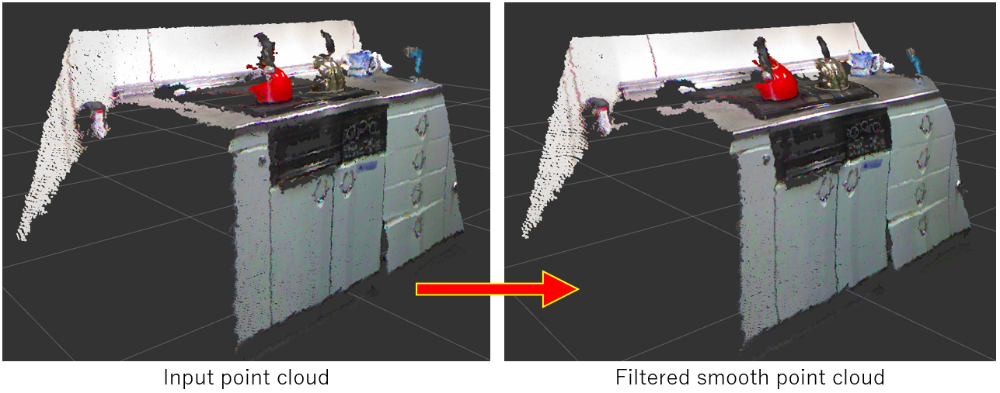

# BilateralFilter

## What Is This


Apply bilateral filter to specified point cloud.

The filter reduces noise, preserves edges and smooth point cloud.


## Subscribing Topic

* `~input` (`sensor_msgs/PointCloud2`)

  Original point cloud.


## Publishing Topic

* `~output` (`sensor_msgs/PointCloud2`)

  Filtered point cloud.


## Parameter

* `~sigma_s` (Float, default: `15.0`)

Standard deviation of Gaussian (a.k.a. spatial sigma).

This parameter can be changed by `dynamic_reconfigure`.


* `~sigma_r` (Float, default: `0.05`)

Standard deviation of gaussian used to control how much an adjacent pixel is downweighted because of the intensity difference (a.k.a. range sigma).

This parameter can be changed by `dynamic_reconfigure`.


## Sample

```bash
roslaunch jsk_pcl_ros sample_bilateral_filter.launch
```
