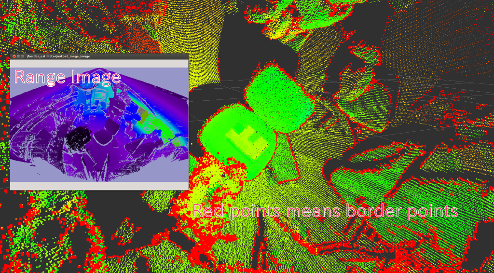

# BorderEstimator


Convert pointcloud into range image and detect border

## Subscribing Topic
* `~input` (`sensor_msgs/PointCloud2`)

  Input pointcloud

* `~input_camera_info` (`sensor_msgs/CameraInfo`)

  Camera info is used to reconstruct organized range image
  when `~model_type` is `planar`

## Publishing Topic
* `~output_cloud` (`sensor_msgs/PointCloud`)

  Pointcloud converted as range image. If `~model_type` is `planar`, it should be
  equal to original organized pointcloud, When `~model_type` is `laser`,
  original pointcloud and `~output_cloud` is not same.

* `~output_border_indices` (`pcl_msgs/PointIndices`)

  Indices of border

* `~output_veil_indices` (`pcl_msgs/PointIndices`)

  Indices of veil points

* `~output_shadow_indices` (`pcl_msgs/PointIndices`)

  Indices of shadow edge

* `ourput_range_image` (`sensor_msgs/Image`)

  Range image

## Parameters
* `~model_type` (String, default: `planar`)

  Choose model type of range image by this topic. `planar`, `laser` or `sphere` is
  allowed.

* `~angular_resolution` (Double, default: `0.5`)

  Angular resolution of range image. Only does `laser` model use this parameter.

* `~noise_level` (Double, default: `0.1`)

  Noise level of pointcloud. Only does `laser` model use this parameter.

* `~min_range` (Double, default: `0.0`)

  Minimam distance to take into account range image. Only does `laser` model use this parameter.

* `~border_size` (Integer, default: `0`)

  Border size to remove from range image.

* `~max_angle_height` (Double, default: `2pi`)

  Maximum angle height of range image. Only does `laser` model use this parameter.

* `~max_angle_width` (Double, default: `2pi`)

  Maximum angle width of range image. Only does `laser` model use this parameter.

## Sample

```bash
roslaunch jsk_pcl_ros sample_border_estimator.launch
```
