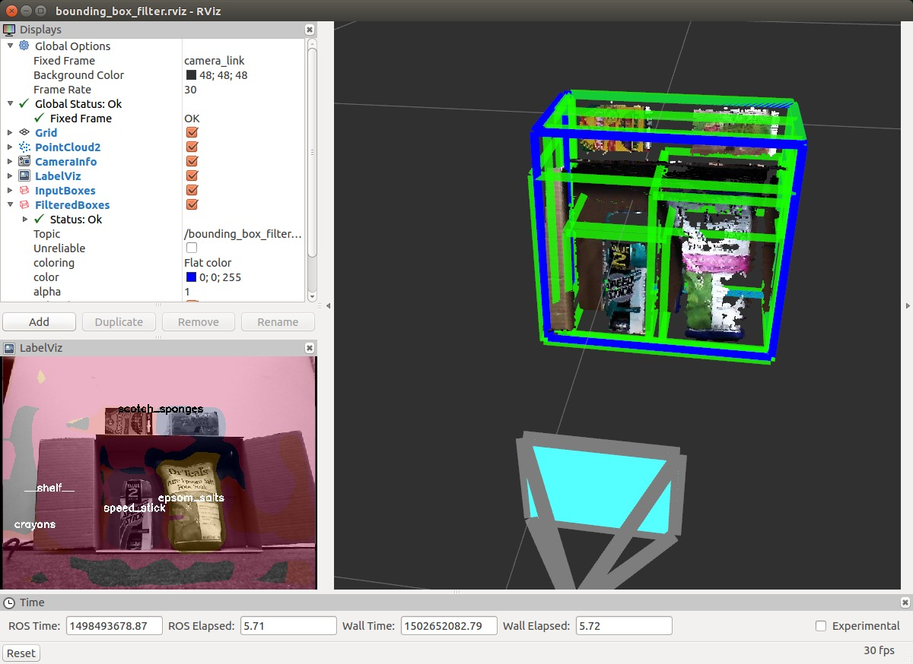

# BoundingBoxFilter



Filter bounding boxes (`jsk_recognition_msgs/BoundingBoxArray`) with threshold of bounding box dimensions.
Optionally with indices (`jsk_recognition_msgs/ClusterPointIndices`).

## Publishing Topics

* `~output_box` (`jsk_recognition_msgs/BoundingBoxArray`)

  Filtered bounding boxes.

* `~output_indices` (`jsk_recognition_msgs/ClusterPointIndices`)

  Cluster indices filtered with indices of filtered bounding boxes.
  Published only with `~with_indices`.

## Subscribing Topics

* `~input_box` (`jsk_recognition_msgs/BoundingBoxArray`)

  Input bounding boxes.

* `~input_indices` (`jsk_recognition_msgs/ClusterPointIndices`)

  Input cluster point indices. Subscribed only with `~with_indices`.

## Parameters

- `~with_indices` (bool, default: `true`, optional)

  Flag to enable filtering cluster indices also.

- `~use_x_dimension`, `~use_y_dimension`, `~use_z_dimension` (bool, default: `false`, optional, dynparam)

  Flag to filtering with `x`, `y`, or `z` dimensions.

- `~x_dimension_min`, `~y_dimension_min`, `~z_dimension_min` (float, default: `0.1`, optional, dynparam)

  Minimum threshold of `x`, `y`, or `z` dimensions.

- `~x_dimension_max`, `~y_dimension_max`, `~z_dimension_max` (float, default: `0.1`, optional, dynparam)

  Maximum threshold of `x`, `y`, or `z` dimensions.

- `~filter_limit_negative` (bool, default: `false`, optional, dynparam)

  Set to true if we want to return the data outside [filter_limit_min; filter_limit_max].

## Sample

```bash
roslaunch sample_bounding_box_filter.launch
```
