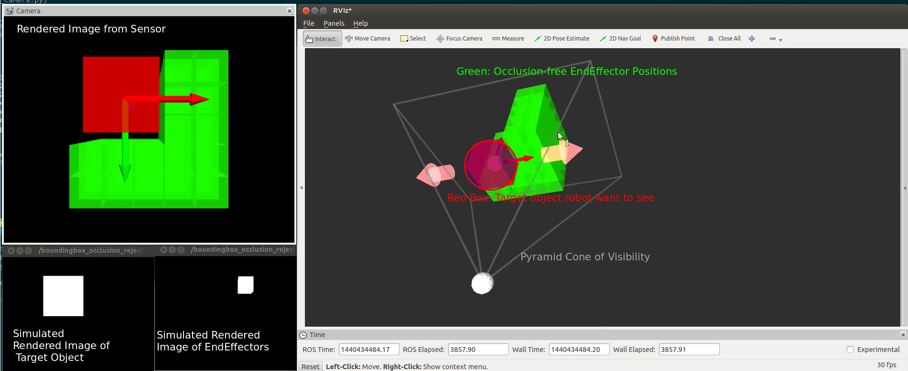

# BoundingBoxOcclusionRejector

Rejects bounding boxes which occludes target object.


## Publishing Topics
* `~output` (`jsk_recognition_msgs/BoundingBoxArray`)

  Occlusion free candidate bounding boxes.

* `~output/target_image` (`sensor_msgs/Image`)

  Rendered mask image of target bounding boxes.

* `~output/candidate_image` (`sensor_msgs/Image`)

  Rendered mask image of candidate bounding boxes.


## Subscribing Topics
* `~input/camera_info` (`sensor_msgs/CameraInfo`)

  CameraInfo of sensor.

* `~input/target_boxes` (`jsk_recognition_msgs/BoundingBoxArray`)

  BoundingBox array to represent target objects to see.

* `~input/candidate_boxes` (`jsk_recognition_msgs/BoundingBoxArray`)

  BoundingBox array of candidate objects.

Note that frame ID of all 3 input topics should be the same.


## Sample

```bash
roslaunch jsk_pcl_ros sample_boundingbox_occlusion_rejector.launch
```
