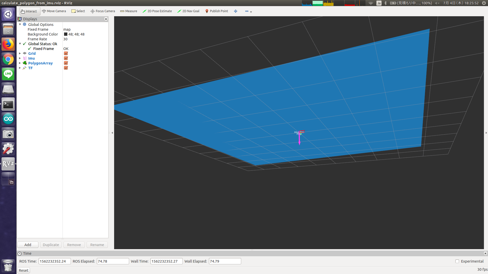

# calculate_polygon_from_imu.py



## What Is This

It retrieves `sensor_msgs/Imu` and publish perpendicular plane as polygon array.


## Subscribing Topic

* `imu_data` (`sensor_msgs/Imu`)

  Imu data.
  Only `linear_acceleration` field will be used to calculate polygon.


## Publishing Topic

* `polygon_array` (`jsk_recognition_msgs/PolygonArray`)

  Output plane polygon array.

* `model_coeffients_array` (`jsk_recognition_msgs/ModelCoefficientsArray`)

  Normal vector of plane.


## Parameters

None.


## Sample

```bash
roslaunch jsk_pcl_ros sample_calculate_polygon_from_imu.launch
```
