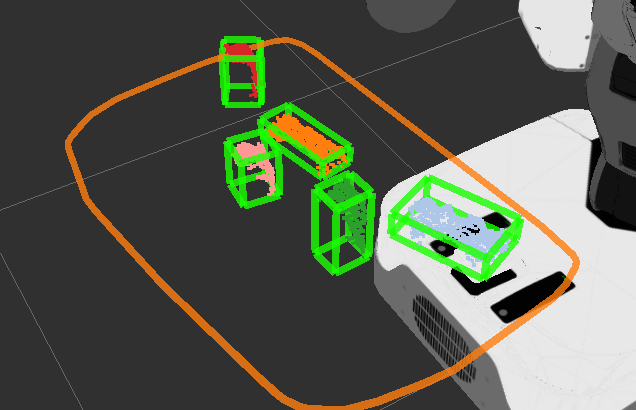

# ClusterPointIndicesDecomposer

## What is this
Decompose `jsk_recognition_msgs/ClusterPointIndices` into array of topics of `sensor_msgs/PointCloud` like `~output00`, `~output01` and so on.
It also publishes tf of centroids of each cluster and oriented bounding box of them. The direction of the bounding box are aligned on to the nearest planes if available.

## Subscribing topics
* `~input` (`sensor_msgs/PointCloud2`):

   Input pointcloud.
* `~target` (`jsk_recognition_msgs/ClusterPointIndices`):

   Input set of indices to represent clusters.
* `~align_planes` (`jsk_recognition_msgs/PolygonArray`):
* `~align_planes_coefficients` (`jsk_recognition_msgs/ModelCoefficientsArray`):

   The planes for bounding box to be aligned on.

## Publishing topics

**Default Topics**

* `~debug_output` (`sensor_msgs/PointCloud2`):

   Concatenate all the clusters into one pointcloud and colorize each cluster to see the result of segmentation.
* `~boxes` (`jsk_recognition_msgs/BoundingBoxArray`):

   Array of oriented bounding box for each segmented cluster.

   If `~align_boxes`, `~align_boxes_with_plane` and `~fill_boxes_label_with_nearest_plane_index` are `True`,
   each box(`jsk_recognition_msgs/BoundingBox`)'s label indicates nearest plane index.

* `~label` (`sensor_msgs/Image`):

   Label image for each cluster point indices.
   You can visualize it with [jsk_perception/ColorizeLabels](../../jsk_perception/nodes/colorize_labels.md)

* `~mask` (`sensor_msgs/Image`):

   Mask image generated from cluster point indices.

* `~centroid_pose_array` (`geometry_msgs/PoseArray`)

   Each cloud's centroid poses.

* `~negative_indices` (`pcl_msgs/PointIndices`)

  Point indices which are not included in input indices.

* `~cluster_indices` (`jsk_recognition_msgs/ClusterPointIndices`)

  Sorted cluster point indices.

**Optional Topics**

* `~output%02d` (`sensor_msgs/PointCloud2`):

   Series of topics for each pointcloud cluster.
   This is published only when `publish_clouds` is `true`.

* `/tf` (`tf2_msgs/TFMessage`)

   Transformation of each decomposed points' center of gravity.

## Parameters

* `~approximate_sync` (Boolean, default: `False`):

   Policy of synchronization, if `False` it synchronizes exactly,
   else approximately.
* `~queue_size` (Int, default: `100`):

   Queue size of topic msgs for synchronization.
* `~publish_tf` (Boolean, default: `False`):

   Toggle tf publishing.
* `~publish_clouds` (Boolean, default: `False`):

   Toggle `~output%02d` topics.

* `~align_boxes` (Boolean, default: `False`):

  * `~align_boxes_with_plane` (Boolean, default: `True`):
    * Is enabled only if `~align_boxes` is `True`.

  * If `~align_boxes` is `True` and `~align_boxes_with_plane` is `True`:
    * Topics `~align_planes` and `~align_planes_coefficients` are enabled.
  * If `~align_boxes` is `True` and `~align_boxes_with_plane` is `False`:
    * Parameter `~target_frame_id` is required, and bounding boxes are aligned with the target frame.

  See `sample/sample_cluster_point_indices_decomposer.launch` also.

* `~use_pca` (Boolean, default: `False`):

   Run PCA algorithm on each cluster to estimate x and y direction.
   The x-axis indicates the first principal component and y-axis indicates the second one.

* `~force_to_flip_z_axis` (Boolean, default: `True`)

   Flip z axis direction if this value is true.

* `~max_size`, `~min_size` (Int, default: `-1`, `-1`)

   If positive value, ignores cluster which points size is external from (`clusterPointsSize` < `~min_size` or `clusterPointsSize` > `~max_size`).

* `~sort_by` (String, default `input_indices`)

  Sort output indices. Currently below options are supported:]
    - `input_indices`: same order as the input cluster indices
    - `z_axis`: sort by z axis of cloud
    - `cloud_size`: sort by size of cloud

* `~fill_boxes_label_with_nearest_plane_index` (Boolean, default: `False`):

    If `~align_boxes`, `~align_boxes_with_plane` and this value are `True`,
    each box(`jsk_recognition_msgs/BoundingBox`)'s label indicates nearest plane index.

## Sample

```bash
roslaunch jsk_pcl_ros sample_cluster_point_indices_decomposer.launch
roslaunch jsk_pcl_ros sample_cluster_point_indices_decomposer_sort_by.launch
```
