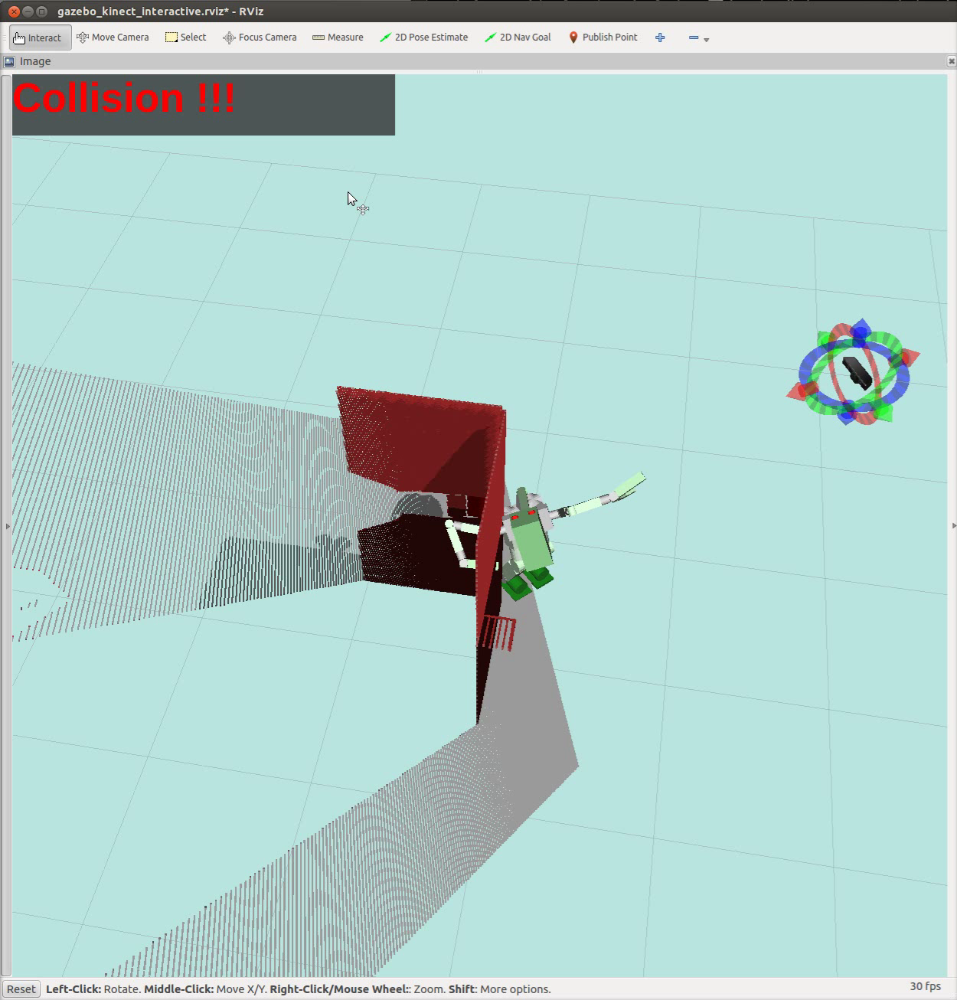
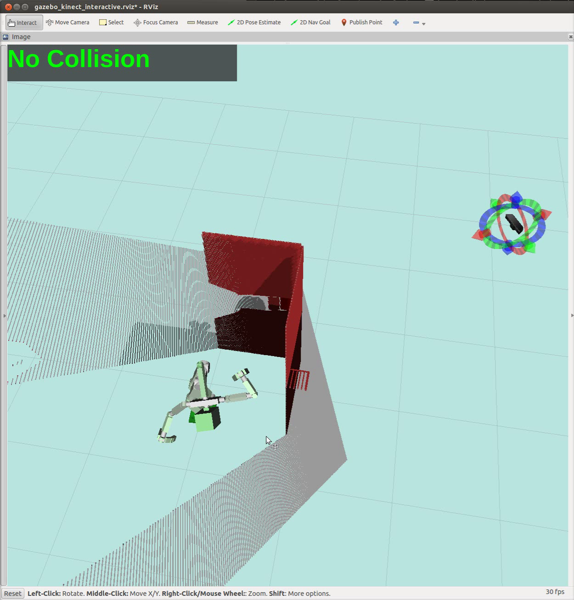

# CollisionDetector


## What Is This
Collision check between robot model and point cloud.

This node has service interface.
You can request collision check by service.

## Subscribing Topics
* `~input` (`sensor_msgs/PointCloud2`):

   input pointcloud.

## Publishing Topics

None.

## Advertising Services
* `~check_collision` (`jsk_recognition_msgs/CheckCollision`):

   Service interface to check collision.
   `joint` is the joint state of robot.
   `pose` is the pose of root link, which is specified by the parameter `~root_link_id`.

```
sensor_msgs/JointState joint
geometry_msgs/PoseStamped pose
---
bool result
```

## Parameters
* `~world_frame_id` (String, default: `map`)

  World frame_id.
* `~robot_description` (String, required)

  robot_description of the collision-checked robot.
  The namespace is private, so you can specify the robot, which is different from global robot_description.
* `~root_link_id` (String, default: `BODY`)

  The name of robot root link.
* `~self_see_default_padding` (Double, default: `0.01`)

  Same as the parameter in [self_filter](http://wiki.ros.org/self_see_filter).
  Padding of robot link in collision check.
* `~self_see_default_scale` (Double, default: `1.0`)

  Same as the parameter in [self_filter](http://wiki.ros.org/self_see_filter).
  Scale of robot link in collision check.
* `~self_see_links` (Array of link configuration, required)

  Same as the parameter in [self_filter](http://wiki.ros.org/self_see_filter).
  Configuration of links for collision check.
  Link configuratin consists of name (required), padding (optional), and scale (optional).
* `~publish_tf` (Boolean, default: `False`)

   Publish tf of robot links.
   This is useful to display robot model in Rviz.

## Sample

```
roslaunch jsk_pcl_ros sample_collision_detector.launch
```
