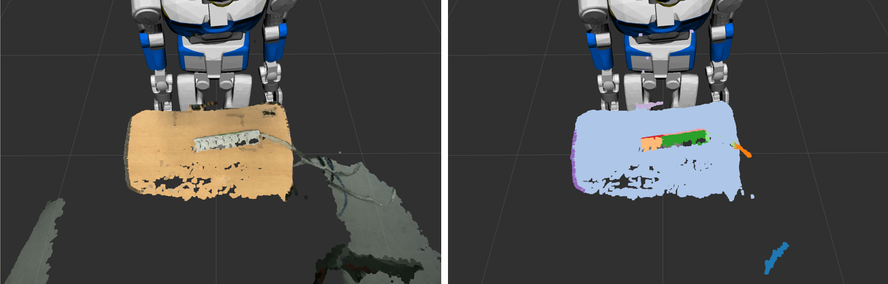

# ColorBasedRegionGrowingSegmentation
.

jsk\_pcl/ColorBasedRegionGrowingSegmentation segments regions based on the color .

## Subscribing Topics
* `~input` (`sensor_msgs/PointCloud2`):

   input pointcloud.

## Publishing Topics
* `~output` (`jsk_recognition_msgs/ClusterPointIndices`):

  Result of region growing segmentation.

## Parameters
* `~distance_threshold` (Integer, default: `10`)

   Distance threshold to determine whether the point is neighbouring or not.

* `~point_color_threshold` (Integer, default: `6`)

   Color threshold is used for testing points color.

* `~region_color_threshold` (Intefer, default: `5`)

   This threshold used when the merging process takes place.

* `~min_cluster_size` (Integer, default: `600`)

   Minimum number of cluster size.
