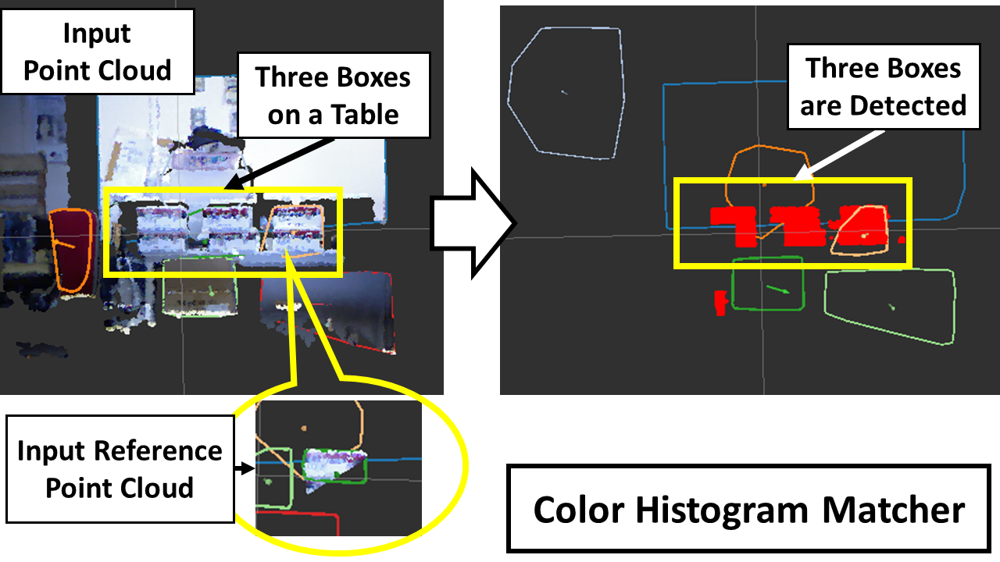

# ColorHistogramMatcher

## What is this



Finds objects similar to a selected object as reference based on bhattacharyya distance of color histogram. 

## Subscribing Topics

- `~input` (`sensor_msgs::PointCloud2`):

  Input point cloud.
- `~input_indices` (`jsk_recognition_msgs::ClusterPointIndices`):

  Input indices related to input point cloud.
- `~input_reference_cloud` (`sensor_msgs::PointCloud2`):

  Input target point cloud as reference.
- `~input_reference` (`jsk_recognition_msgs::ColorHistogram`):

  Input reference color histogram.

## Publishing Topic

- `~output` (`jsk_recognition_msgs::ClusterPointIndices`):

  Output Indices of satisfying color histogram similarity.
- `~output_reference` (`jsk_recognition_msgs::ColorHistogram`):

  Output of histogram from input referenced point cloud.
- `~output_histograms` (`jsk_recognition_msgs::ColorHistogramArray`):

  Output of all histograms from clustered input point cloud.
- `~coefficient_points` (`sensor_msgs/PointCloud2`):

  Output of heat map point cloud.
- `~best_match` (`geometry_msgs/PoseStamped`):

  Output of best match indices points pose.

## Parameters

- `coefficient_threshold` (Double, default: `0.9`)

  Threshold for determining color histogram similarity

- `bin_size` (Double, default: `10`)

  Number of bins of histogram

- `histogram_method` (Int, default: `3`) 

  Histogram Comparing method.

  - 0: HUE
  - 1: SATURATION
  - 2: VALUE
  - 3: HUE AND SATURATION

## Sample

``` 
roslaunch jsk_pcl_ros sample_color_histogram_matcher.launch
```
Please refer to ``` SelectedClusterPublisher ``` on how to select a referenced object. 