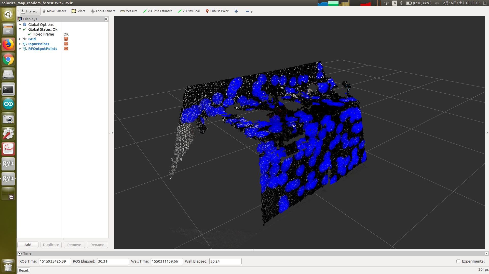

# ColorizeMapRandomForest

## What Is This


Extract FPFH (Fast Point Feature Histograms) from input point cloud, and classify each cluster into 2 categories using Random Forest classifier.

This node internally applies x, y and z filter as preprocessing.

In contrast to `jsk_pcl_ros/ColorizeRandomForest`, this node does not run euclidean clustering as preprocessing.


## Subscribing Topic

* `~input` (`sensor_msgs/PointCloud2`)

  Input point cloud from which specified part will be extracted.


## Publishing Topic

* `~output/debug_points` (`sensor_msgs/PointCloud2`)

  Output point cloud for debugging. Red means classification result == 0, blue means the other.


## Parameter

* `~rs` (Float, default: `0.03`)

  Radius in meters used for searching FPFH.

* `~po` (Float, default: `0.03`)

  Offset in meters used for pass through filter.

* `~po2` (Float, default: `0.06`)

  Another offset in meters used for pass through filter.

* `~sum_num` (Int, default: `100`)

  Number of points used for averaging FPFH histogram.


## Calling Service

* `~classify_server` (`ml_classifiers/ClassifyData`)

  Random Forest server for classification.


## Sample

```bash
roslaunch jsk_pcl_ros sample_colorize_map_random_forest.launch
```
