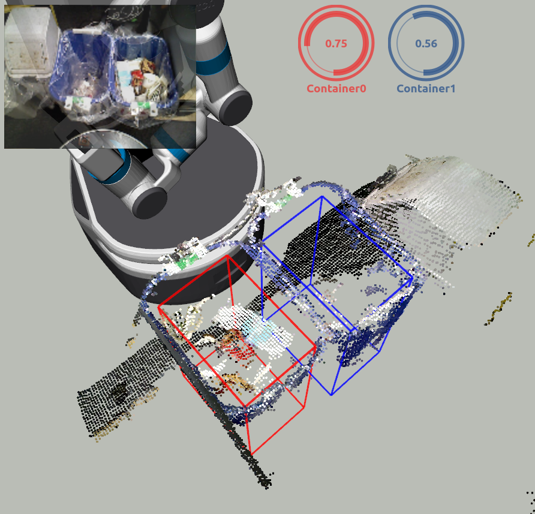

# ContainerOccupancyDetector
## What Is This


It subscribes containers' boxes (`jsk_recognition_msgs/BoundingBoxArray`) and point cloud in the each boxes (`sensor_msgs/PointCloud2`, `jsk_recognition_msgs/ClusterPointIndices`) then publish their occupancies (`jsk_recognition_msgs/BoundingBoxArray`). Their occupancy rates are in each boxes' `value` field.

## Subscribing Topic
* `~container/boxes` (`jsk_recognition_msgs/BoundingBoxArray`)

Containers input.

* `~container/points` (`sensor_msgs/PointCloud2`)

Original pointcloud.

* `~container/point_indices` (`jsk_recognition_msgs/ClusterPointIndices`)

The indices of point cloud in each box.

## Publishing Topic
* `~container/occupancies` (`jsk_recognition_msgs/BoundingBoxArray`)

Containers' occupancies.

## Parameters
* `~approximate_sync` (Bool, default: `false`)

  Approximately synchronize inputs if it's true.

* `~queue_size` (Int, default: `100`)

  How many messages you allow about the subscriber to keep in the queue.
  This should be big when there is much difference about delay between two topics.

## For use
It is strongly recommended to use with original launch file like

```bash
roslaunch jsk_pcl_ros container_occupancy_detector.launch POINTCLOUD_INPUT:=<your point cloud> CONTAINER_BOXES_INPUT:=<your containers>
```

## Sample

```bash
roslaunch jsk_pcl_ros sample_container_occupancy_detector.launch
```
