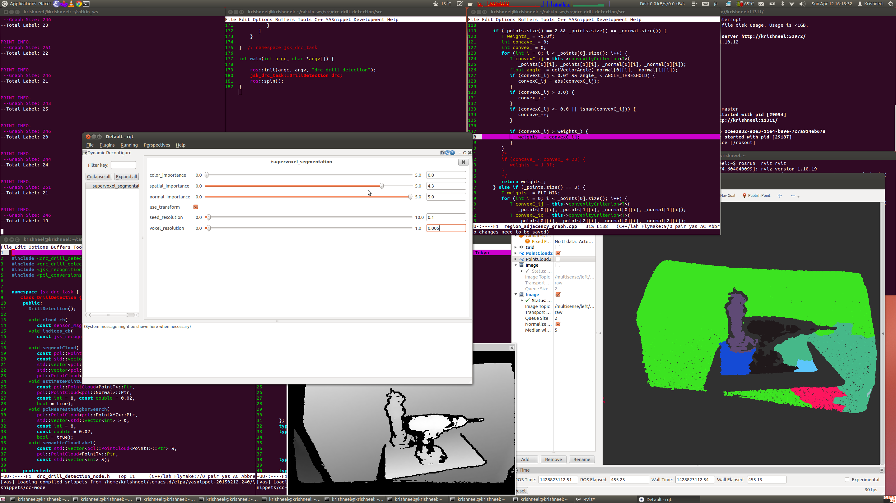

# ConvexConnectedVoxels


Merges the voxels initially segmented using SuperVoxel Segmentation into high level object representations by merging the voxels based on convexity measurements.

## Subscribing Topics
* `~input/indices` (`jsk_recognition_msgs/ClusterPointIndices`)
* `~input/cloud` (`sensor_msgs/PointCloud2`)

  Input is set of voxel indices and point cloud from the supervoxel_segmentation nodelet

## Publishing Topics
* `~output/indices` (`jsk_recognition_msgs/ClusterPointIndices`)

  Output is set of merged voxel indices

## Sample

```bash
roslaunch jsk_pcl_ros sample_convex_connected_voxels.launch
```
