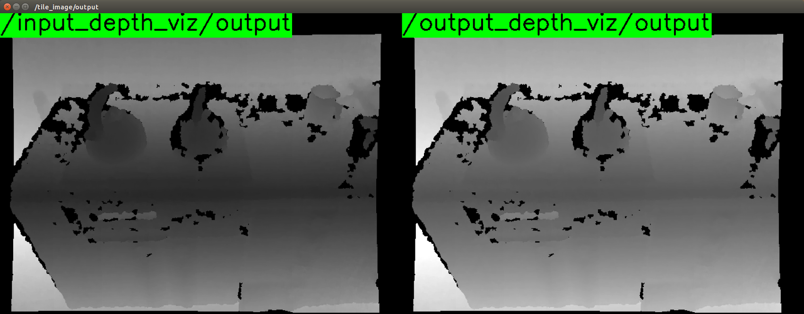

# DepthCalibration



## What Is This

This nodelet applies calibration model to depth image.

## Subscribing Topic
* `~input` (`sensor_msgs/Image`)

  Input depth image.

  The encoding should be `32FC1`.

* `~camera_info` (`sensor_msgs/CameraInfo`)

  Input camera_info of depth camera.

## Publishing Topic
* `~output` (`sensor_msgs/Image`)

  Output depth image.

## Advertising Service
* `~set_calibration_parameter` (`jsk_recognition_msgs/SetDepthCalibrationParameter`)

  Update parameters below except for `~uv_scale`.

## Parameter
* `~coefficients2` (Array of double, default: `[0, 0, 0, 0, 0]`)

  coefficients of calibration model.

* `~coefficients1` (Array of double, default: `[0, 0, 0, 0, 1.0]`)

  coefficients of calibration model.

* `~coefficients0` (Array of double, default: `[0, 0, 0, 0, 0]`)

  coefficients of calibration model.

* `~use_abs` (Boolean, default: `False`)

  If you want to use absolute value in applying calibration model, please set this variable True.

* `~uv_scale` (Double, default: `1.0`)

  If you want to scale value in applying calibration model, please set this variable.

## Sample
```bash
roslaunch jsk_pcl_ros sample_depth_calibration.launch
```
