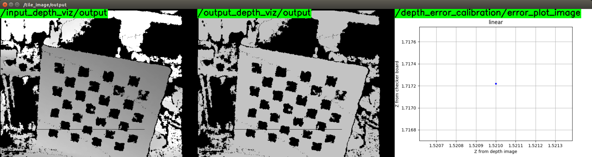

# depth_error_calibration.py



## What Is This

This nodelet stores result of depth error calculated by
[DepthImageError](../../jsk_pcl_ros_utils/nodes/depth_image_error.md) and
dump calibration parameter into CSV file (`calibration-%Y-%m-%d-%H-%M-%S.csv`).

## Subscribing Topic

* `depth_image_error/output` (`jsk_recognition_msgs/DepthErrorResult`)

  Result of depth error.


## Publishing Topic

* `~frequency_image` (`sensor_msgs/Image`)

  Frequency map.

* `~error_plot_image` (`sensor_msgs/Image`)

  Plot of relation between Z from depth image and Z from checker board.


## Internally Calling Service

* `/camera_remote/depth_calibration/set_calibration_parameter` (`jsk_recognition_msgs/SetDepthCalibrationParameter`)

  Set depth calibration parameters.


## Parameter

* `~u_min` (Int, default: `0`)
* `~u_max` (Int, default: `4096`)
* `~v_min` (Int, default: `0`)
* `~v_max` (Int, default: `4096`)

  Minimum/maximum limit of (u, v) of checkerboard corner.


## Sample

```bash
roslaunch jsk_pcl_ros sample_depth_error_calibration.launch
```
