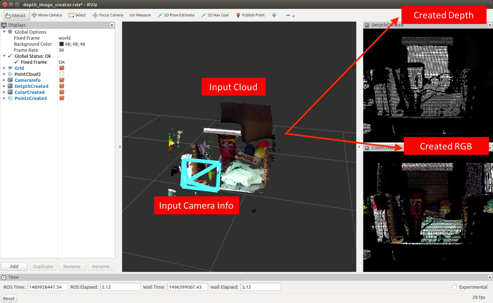

# DepthImageCreator



## What is this
Create *organized* pointcloud from non-organized pointcloud.
Currently it supports `pcl::PointXYZ` and `pcl::PointXYZRGB` as the input.

## Subscribing Topics
* `~input` (`sensor_msgs/PointCloud2`):

   The input pointcloud to be reconstructed as organized pointcloud.
* `~info` (`sensor_msgs/CameraInfo`):

   Put a simulated camera according to `~info` and generate organized pointcloud.

## Publishing Topics
* `~output` (`sensor_msgs/Image`):

   Publish organized pointcloud as depth image.
* `~output_image` (`sensor_msgs/Image`):

   Publish image colorized according to the input cloud.
* `~output_cloud` (`sensor_msgs/PointCloud2`)

   Output pointcloud.

   See `~organize_cloud` parameter.

* `~output_disp` (`sensor_msgs/DisparityImage`)

   Publish organized pointcloud as disparity image.

## Parameters
* `~scale_depth` (Double, default: `1.0`)

   scale depth value.
* `~use_fixed_transform` (Boolean, default: `False`):
* `~translation` (Array of double, default: `[0, 0, 0]`)
* `~rotation` (Array of double, default: `[0, 0, 0, 1]`)

   If `~use_fixed_transform` is set to `True`,
   transformation between `~input` and `~info` is not resolved via tf
   but fixed transformation is used according to `~rotation` and `translation`.
* `~use_asynchronous` (Boolean, default: `False`)

   Do not synchronize `~input` and `~info` if this parameter is set to `True`.
* `~use_approximate` (Boolean, default: `False`)

   Synchronize `~input` and `~info` approximately if this parameter is set to `True`.
* `~info_throttle` (Integer, default: `0`)

   The number of `~info` messages to skip to generate depth image.
* `~max_queue_size` (integer, default: `3`):

   Queue length for synchronization of topics.

* `~max_pub_queue_size` (integer, default: `~max_queue_size_`):

   Queue length of topic publishers.
   Default is value set for `max_queue_size_`.

* `~max_sub_queue_size` (integer, default: `~max_queue_size_`):

   Queue length of topic subscribers.
   Default is value set for `max_queue_size_`.

* `~fill_value` (float, default: `nan`):

   Initial value of depth image. The pixels where there is no corresponding point
   are filled by this value.

* `~organize_cloud` (Boolean, default: `False`)

   Whether to organize `~output_cloud` or not.

* `~tf_duration` (float, default: `0.001`):

  TF Lookup transform duration. This value is only used when `use_fixed_transform` is `false`.

## Sample

```bash
roslaunch jsk_pcl_ros sample_depth_image_creator.launch
```
