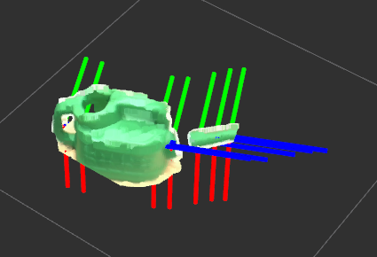
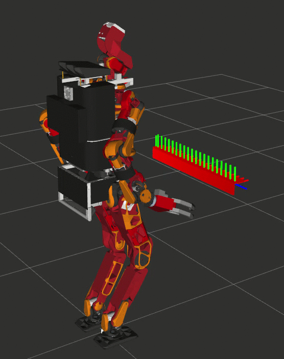

# DetectGraspablePosesPcabase
## What Is This

Detect_graspable_poses_pcabase.py is a program which publishes pose array where a robot can grasp, using point cloud of a target object and PCA algorithm. In the above image, the grasp poses are visualized with the axies. Please transform input cloud to a flame which direction is the same as the robot (e.g. /BODY) before using this program.

The above image illustrates an example way to use this node. Axies represent poses where the robot can grasp.

## [Example videos using a real robot (only allowed for the jsk members)](https://drive.google.com/open?id=1ptbNfrAsnWUF6fNlU3guqpY2VU-ZyDTv)

## Subscribing Topic
* `~input` (`sensor_msgs/PointCloud2`)

  Input pointcloud. RGB field is required.

## Publishing Topic
* `~output/can_grasp_poses` (`geometry_msgs/PoseArray`)

  PoseArray where a robot can grasp.

## Parameters
* `~direction` (Character, default: `x`)

  From which direction a robot try to grasp a target object. ('x': from the front, 'z': from the top)
* `~hand_width[m]` (Float, default: `0.13`)

  How long a robot can spread its hand.
* `~interval_m[m]` (Float, default: `0.04`)

  Interval between target poses. Please decrease this number if you want to detect more possible grasp poses.
