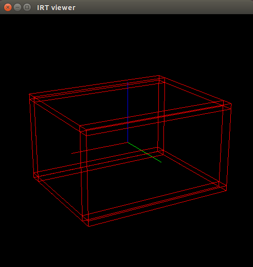

# display-bounding-box-array.l



Show `jsk_recognition_msgs/BoundingBoxArray` in IRT viewer in Euslisp.

## Subscribing Topics

* `/cluster_decomposer/boxes` (`jsk_recognition_msgs/BoundingBoxArray`)

  Input bounding box array.


## Sample

```bash
roslaunch jsk_pcl_ros sample_display_bounding_box_array.launch
```
