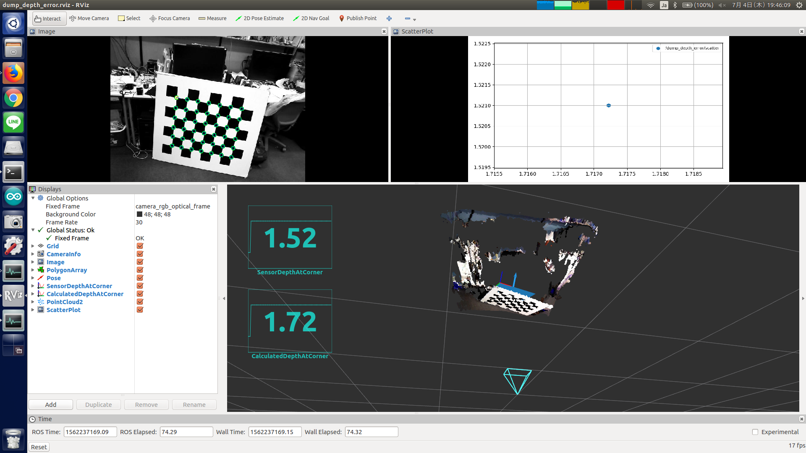

# dump_depth_error.py



## What Is This

This node retrieves `jsk_recognition_msgs/DepthErrorResult`, and publish
(true_depth, observed_depth) as a 2D plot data.

It also dump the data to CSV file.


## Subscribing Topic

* `/depth_image_error/output` (`jsk_recognition_msgs/DepthErrorResult`)

  Depth error result calculated by
  [jsk_pcl_utils/DepthImageError](../../jsk_pcl_ros_utils/nodes/depth_image_error.md).


## Publishing Topic

* `~scatter` (`jsk_recognition_msgs/PlotData`)

  2D plot data of true_depth and observed_depth.


## Parameters

* `~csv_path` (String, default: `output.csv`)

  Path to output CSV file.


## Sample

```bash
roslaunch jsk_pcl_ros sample_dump_depth_error.launch
```
