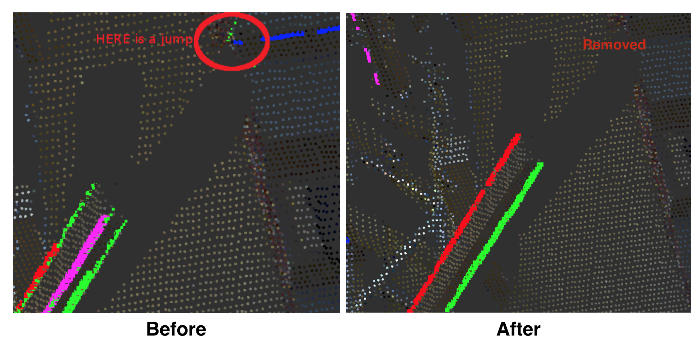

EdgeDepthRefinement
===================

What is this?
-------------

Refine edges based on depth connectivity.

In order to take continuity into account, it run RANSAC and remove outliners.

Subscribing Topics
------------------

- ``~input`` (``sensor_msgs/PointCloud2``)

- ``~input_indices`` (``jsk_recognition_msgs/ClusterPointIndices``)

Publishing Topics
-----------------

- ``~output`` (``jsk_recognition_msgs/ClusterPointIndices``)

- ``~output_coefficients`` (``jsk_recognition_msgs/ModelCoefficientsArray``)

- ``~output_outlier_removed`` (``jsk_recognition_msgs/ClusterPointIndices``)

- ``~output_outlier_removed_coefficients`` (``jsk_recognition_msgs/ModelCoefficientsArray``)

Parameters
----------

- ``~outlier_distance_threshold`` (``Double``, default: ``0.01``)

- ``~min_inliers`` (``Int``, default: ``10``)

- ``~duplication_angle_threshold`` (``Double``, default: ``0.1``)

- ``~duplication_distance_threshold`` (``Double``, default: ``0.01``)

Sample
------

.. code-block:: bash

  roslaunch jsk_pcl_ros sample_edge_depth_refinement.launch
