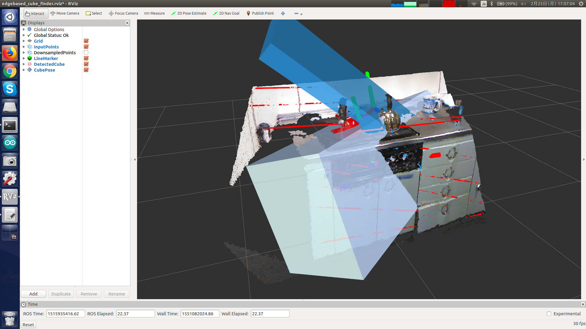

# EdgebasedCubeFinder

## What Is This


Detect cubes by estimating parallel and perpendicular planes from parallel edge pairs.


## Subscribing Topic

* `~input` (`sensor_msgs/PointCloud2`)

  Input point cloud.

* `~input_edges` (`jsk_recognition_msgs/ParallelEdgeArray`)

  Input parallel edge pairs.


## Publishing Topic

* `~output` (`jsk_recognition_msgs/BoundingBoxArray`)

  Detected cubes.

* `~output_pose_array` (`geometry_msgs/PoseArray`)

  Poses of detected cubes.

* `~debug_filtered_cloud` (`sensor_msgs/PointCloud2`)

  Point cloud on edges for debugging.

* `~debug_clusters` (`jsk_recognition_msgs/ClusterPointIndices`)

  This topic is advertised, but not published now.

* `~debug_polygons` (`jsk_recognition_msgs/PolygonArray`)

  This topic is advertised, but not published now.

* `~debug_marker` (`visualization_msgs/Marker`)

  This topic is advertised, but not published now.


## Parameter

* `~outlier_threshold` (Float, default: `0.01`)

  Threshold to remove outliers in meters.

  This parameter can be changed by `dynamic_reconfigure`.

* `~parallel_edge_distance_min_threshold` (Float, default: `0.1`)

  Minimum distance between parallel edges in meters.

  This parameter can be changed by `dynamic_reconfigure`.

* `~parallel_edge_distance_max_threshold` (Float, default: `0.4`)

  Maximum distance between parallel edges in meters.

  This parameter can be changed by `dynamic_reconfigure`.

* `~min_inliers` (Int, default: `1000`)

  This parameter is not used for now.

* `~convex_area_threshold` (Float, default: `0.01`)

  This parameter is not used for now.

* `~convex_edge_threshold` (Float, default: `0.1`)

  This parameter is not used for now.


## Sample

```bash
roslaunch jsk_pcl_ros sample_edgebased_cube_finder.launch
```
