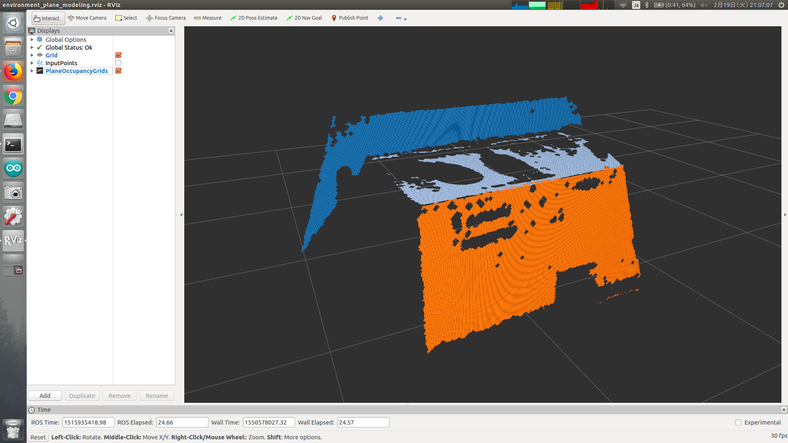

# EnvironmentPlaneModeling

## What Is This


Make environment plane model as occupancy grid from point cloud, plane indices, plane polygons and plane normal coefficients.


## Subscribing Topic

* `~input` (`sensor_msgs/PointCloud2`)

  Input point cloud which contains normal for each point.

  This topic is used for converting plane indices and coefficients into convex polygon.

* `~input/full_cloud` (`sensor_msgs/PointCloud2`)

  Input point cloud which contains normal for each point.

  This topic is used for building grid map.

* `~input/indices` (`jsk_recognition_msgs/ClusterPointIndices`)

  Input point indices of plane.

* `~input/polygons` (`jsk_recognition_msgs/PolygonArray`)

  Input polygons of plane.

* `~input/coefficients` (`jsk_recognition_msgs/ModelCoefficientsArray`)

  Input normal coefficients of plane.

These 5 topics described above must be synchronized.

* `~input/leg_bounding_box` (`jsk_recognition_msgs/BoundingBox`)

  Optional input bounding box.

  Used only when `~complete_footprint_region` is true.

* `/move_base_simple/goal` (`geometry_msgs/PoseStamped`)

  Optional input pose which a user wants robot to move to.


## Publishing Topic

* `~output` (`jsk_recognition_msgs/SimpleOccupancyGridArray`)

  Occupancy grid of plane.

* `~output/non_plane_indices` (`pcl_msgs/PointIndices`)

  Point indices of non-plane region.

* `~debug/magnified_polygons` (`jsk_recognition_msgs/PolygonArray`)

  Magnified plane polygons for debugging.

* `~debug/convex_cloud` (`sensor_msgs/PointCloud2`)

  Vertex point cloud of convex polygons.

* `~debug/plane_poses` (`geometry_msgs/PoseArray`)

  Pose of plane for debugging.

* `~debug/magnified_plane_poses` (`geometry_msgs/PoseArray`)

  Pose of magnified plane for debugging.

* `~debug/raw_grid_map` (`jsk_recognition_msgs/SimpleOccupancyGridArray`)

  Occupancy grid of plane before applying morphological dilation & erosion.

* `~debug/noeroded_grid_map` (`jsk_recognition_msgs/SimpleOccupancyGridArray`)

  Occupancy grid of plane to which morphological filter is applied, but not enough erosion.

* `/footstep_simple/goal` (`geometry_msgs/PoseStamped`)

  Output pose of suitable grid.

  Only published when `/move_base_simple/goal` is subscribed.


## Parameter

* `~complete_footprint_region` (Bool, default: `False`)

  Set to true if you want to complete grid map by `~input/leg_bounding_box`.

* `~footprint_frames` (List of String, default: `[]`)

  Frame ID used for looking up ground plane for footprint.

  Used only when `~complete_footprint_region` is true.

## Sample

```bash
roslaunch jsk_pcl_ros sample_environment_plane_modeling.launch
```
