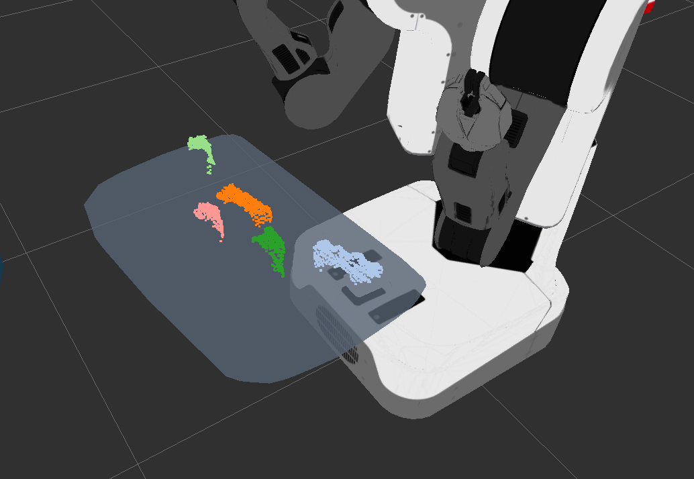

# EuclideanClustering

## What Is This
Segment pointcloud based euclidean metrics, which is based on `pcl::EuclideanClusterExtraction`.
This nodelet has topic interface and service interface.

The result of clustering is published as `jsk_recognition_msgs/ClusterPointIndices`.

If the number of the cluster is not changed across different frames, `EuclideanClustering`
tries to track the segment.

## Subscribing Topics
* `~input` (`sensor_msgs/PointCloud2`):

   input pointcloud. If `~multi` is `false`, this input is only enough.


* `~input/cluster_indices` (`jsk_recognition_msgs/ClusterPointIndices`):

   input indices. If `~multi` is `true`, synchronized `~input` and `~input/cluster_indices` are used.

## Publishing Topics
* `~output` (`jsk_recognition_msgs/ClusterPointIndices`):

   Result of clustering.
* `~cluster_num` (`jsk_recognition_msgs/Int32Stamped`):

   The number of clusters.

## Advertising Services
* `~euclidean_clustering` (`jsk_pcl_ros/EuclideanSegment`):

   Service interface to segment clusters.

```
sensor_msgs/PointCloud2 input
float32 tolerance
---
sensor_msgs/PointCloud2[] output
```

## Parameters
* `~tolerance` (Double, default: `0.02`):

   Max distance for the points to be regarded as same cluster.
* `~label_tracking_tolerance` (Double, default: `0.2`)

   Max distance to track the cluster between different frames.
* `~max_size` (Integer, default: `25000`)

   The maximum number of the points of one cluster.
* `~min_size` (Integer, default: `20`)

   The minimum number of the points of one cluster.

* `~multi` (Boolean, default: `false`)

   Flag of applying euclidean clustering for each pointcloud's indices(`~input/cluster_indices`'s cluster_indices).

   If `~multi` is `true`, synchronized `~input` and `~input/cluster_indices` are used.

* `~approximate_sync` (Boolean, default: `False`):

   Policy of synchronization, if `false` it synchronizes exactly, else approximately.
   This value is only valid in case of `~multi` is `true`.

* `~queue_size` (Int, default: `20`):

   Queue size of topic msgs for synchronization.

* `~downsample_enable` (Boolean, default: `false`)

   Flag of VoxelGrid downsampling. If `~downsample_enable` is `true`, `~input` is downsampled.

* `~leaf_size` (Double, default: `0.01`)

   Leaf size of voxel grid downsampling.
   This value is only valid in case of `~downsample_enable` is `true`.

* `~cluster_filter` (Int, default: `0`)

   Specify cluster filtering methods.

   0: Passthrough the all clustering result for each cluster.

   1: Take a cluster which has the maximum size of those for each cluster.
      The length of `~output`'s cluster_indices, `~cluster_num`, is length of `~input/cluster_indices`'s cluster_indices.


## Sample
Plug the depth sensor which can be launched by openni.launch and run the below command.

```
roslaunch jsk_pcl_ros euclidean_segmentation.launch
```
