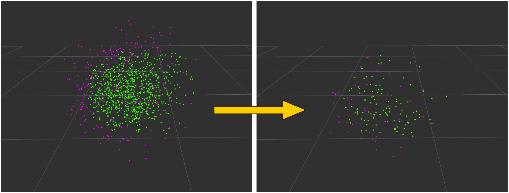

# ExtractCuboidParticlesTopN



Extract top-N particles of `pcl::tracking::ParticleCuboid` by comparing weight of them.

## Publishing Topics
* `~output` (`pcl_msgs/PointIndices`)

  Top-N particles indices.

* `~output/box_array` (`jsk_recognition_msgs/BoundingBoxArray`)

  Top-N particles as BoundingBoxArray.

* `~output/pose_array` (`jsk_recognition_msgs/WeightedPoseArray`)

  Top-N particles as WeightedPoseArray.

## Subscribing Topics
* `~input` (`sensor_msgs/PointCloud2`)

  Particle cloud of `pcl::tracking::ParticleCuboid`.
  All the weights are expected to be normalized.

## Parameters
* `~top_n_ratio` (Float, default: `0.9`)

  Ratio of top-N.

## Sample

```bash
roslaunch jsk_pcl_ros sample_extract_cuboid_particles_top_n.launch
```
