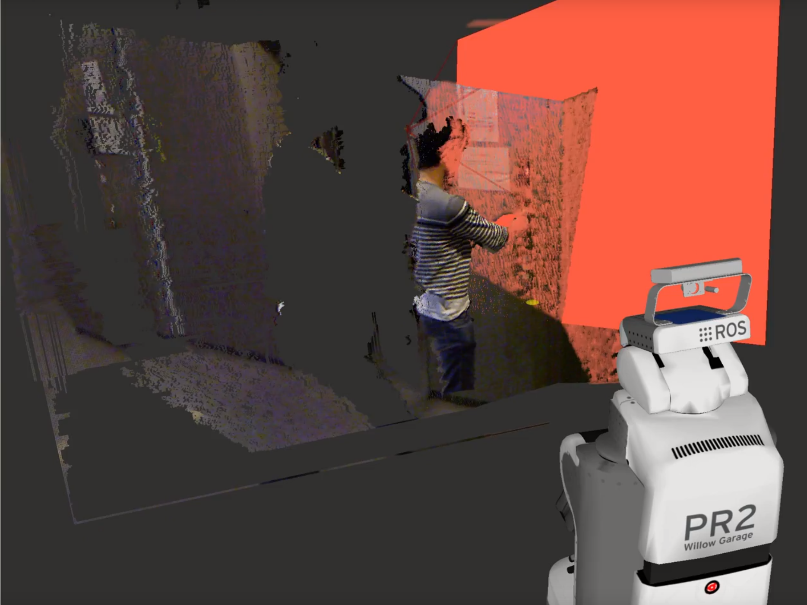

ExtractFieldOfView
==============

What Is This
------------

Extract the pointclouds which is included in calculated camera info.
For example, you can use this when you want to extract robot's pointcloud from human eye.

Subscribing Topic
-----------------

-  ``~input`` (``sensor_msgs/PointCloud2``)

Original depth information from which you extract some of them.

-  ``~indices`` (``sensor_msgs/CameraInfo``)

Camera Parameters which you want to use.

Publishing Topic
----------------

-  ``~output`` (``sensor_msgs/PointCloud2``)

Extracted point cloud.

-  ``~output_camera_info`` (``sensor_msgs/CameraInfo``)

CameraInfo which you use to extract

Parameter
---------

-  ``frame`` (Boolean, default: ``head_mount_kinect_rgb_link``)

Frame which you want to extract from
