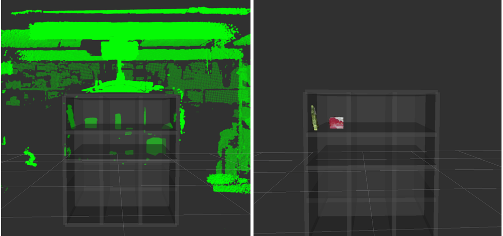

ExtractIndices
==============

What Is This
------------

ExtractIndices extracts point cloud with input point indices.

Upstream package `pcl_ros <http://wiki.ros.org/pcl_ros>`_ has similar node
which extracts point cloud with point indices.
(see `here <https://github.com/ros-perception/perception_pcl/blob/jade-devel/pcl_ros/src/pcl_ros/filters/extract_indices.cpp>`_)

The pros of this node compared to it are:

* supports ``keep_organized`` option when extract cloud.
* connected-based system. (does not subscribe without child subscriber)
* other params. ``max_queue_size``, ``approximate_sync``
* support simple command line interface. (you can run with ``rosrun``)

Subscribing Topic
-----------------

-  ``~input`` (``sensor_msgs/PointCloud2``)

Original depth information from which you extract some of them.

-  ``~indices`` (``pcl_msgs/PointIndices``)

Indices for point cloud you extract.

Publishing Topic
----------------

-  ``~output`` (``sensor_msgs/PointCloud2``)

Extracted point cloud.

Parameter
---------

-  ``keep_organized`` (Boolean, default: ``false``)

Set keep\_organized when extract indices.

-  ``negative`` (Boolean, default: \`false)

Set negative when extract indices.

-  ``max_queue_size`` (Int, default: \`10)

Max queue size for subscribers.

-  ``approximate_sync`` (Boolean, default: ``false``)

If this parameter is true, ``~input`` and ``~indices`` are synchronized
with approximate time policy.

CLI
---

sample::

    $ rosrun jsk_pcl_ros extract_indices ~input:=/kinect2/qhd/points ~indices:=/point_indices _negative:=true

