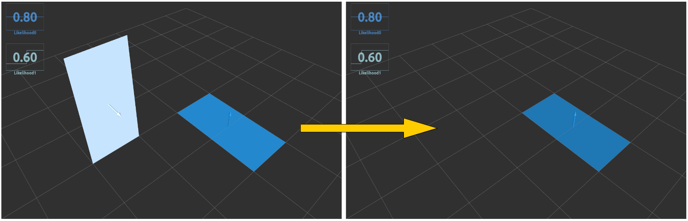

# extract_top_polygon_likelihood.py



## What Is This

Extract maximum likelihood polygon from input polygons.


## Subscribing Topic

* `~input` (`jsk_recognition_msgs/PolygonArray`)

  Polygons which have `likelihood` field.

* `~input/coefficients` (`jsk_recognition_msgs/ModelCoefficientsArray`)

  Normal vector of polygons.


## Publishing Topic

* `~output` (`jsk_recognition_msgs/PolygonArray`)

  Extracted plane polygon array.

* `~output/coefficients` (`jsk_recognition_msgs/ModelCoefficientsArray`)

  Extracted coefficients.


## Parameters

* `~min_likelihood` (Float, default: `0.7`)

  Do not publish anything if all likelihood are smaller than this value.

  This parameter can be changed by `dynamic_reconfigure`.


## Sample

```bash
roslaunch jsk_pcl_ros sample_extract_top_polygon_likelihood.launch
```
