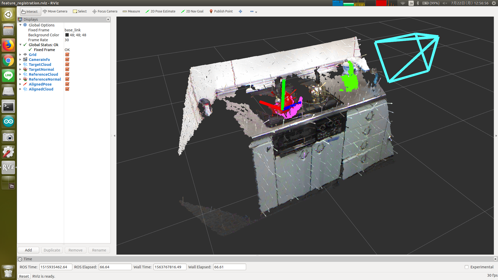

# FeatureRegistration



Align pointcloud using 3d feature. Currently only FPFH is supported.

## Subscribing Topic
* `~input` (`sensor_msgs/PointCloud2`)

   Input pointcloud. The type of point is `pcl::PointNormal`.
* `~input/feature` (`sensor_msgs/PointCloud2`)

   Input feature. The type of point is `pcl::FPFHSignature33`.
* `~input/reference/cloud` (`sensor_msgs/PointCloud2`)

   Reference pointcloud. The type of point is `pcl::PointNormal`.
* `~input/reference/feature` (`sensor_msgs/PointCloud2`)

   Reference feature. The type of point is `pcl::FPFHSignature33`.

## Publishing Topic
* `~output` (`geometry_msgs/PoseStamped`)

  Transformation to align reference cloud to input cloud.
* `~output/cloud` (`sensor_msgs/PointCloud2`)

  Reference pointCloud which is aligned to input cloud.

## Parameters
* `~max_iterations` (Integer, default: `1000`)

  Maximum number of iterations.

* `~correspondence_randomness` (Integer, default: `2`)

  Number of neighbors to use when selecting a random feature correspondence.

  A higher value will add more randomness to the feature matching.

* `~similarity_threshold` (Double, default: `0.9`)

  Similarity threshold in [0,1] between edge lengths of the underlying polygonal
  correspondence rejector object, where 1 is a perfect match.

* `~max_correspondence_distance` (Double, default: `0.0075`)

  Maximum distance threshold between two correspondent points in source <-> target.

* `~inlier_fraction` (Double, default: `0.25`)

  Required inlier fraction of the input in [0, 1]

* `~transformation_epsilon` (Double, default: `0.1`)

  Maximum allowable difference between two consecutive transformations
  in order for an optimization to be considered as having converged to the final solution.

These parameters can be changed by `dynamic_reconfigure`.

## Sample

```bash
roslaunch jsk_pcl_ros sample_feature_registration.launch
```
