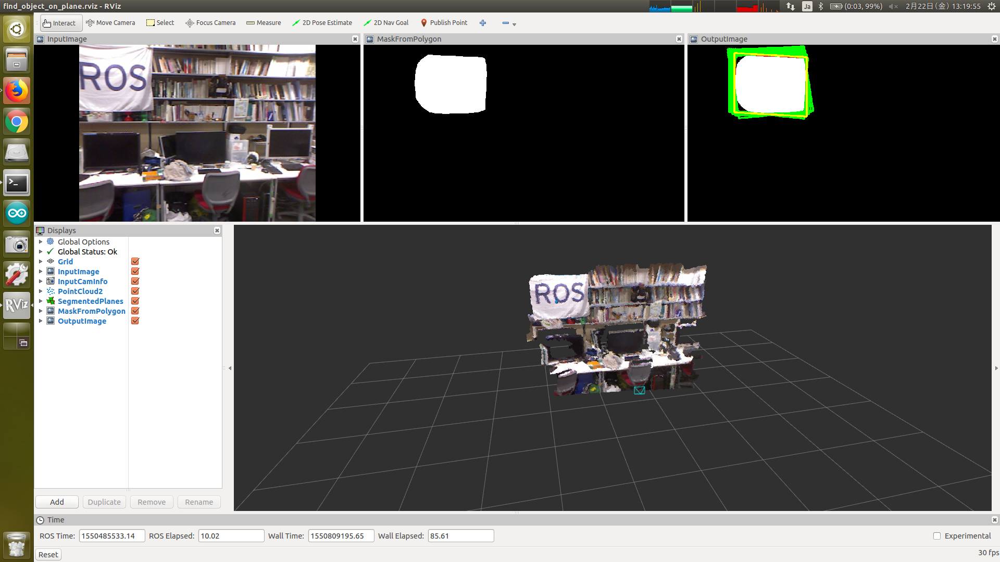

# FindObjectOnPlane

## What Is This


List up bounding parallelogram of input 2D mask image using 3D plane normal coefficients, and choose the minimum area from them.


## Subscribing Topic

* `~input` (`sensor_msgs/Image`)

  Input mask image.

* `~input/camera_info` (`sensor_msgs/CameraInfo`)

  Input camera info.

* `~input/coefficients` (`pcl_msgs/ModelCoefficients`)

  Input normal coefficients of plane.


## Publishing Topic

* `~debug/min_area_rect_image` (`sensor_msgs/Image`)

  Visualization of minimum bounding parallelogram of mask.

  Red rectangle is aligned to x and y axis.

  Green parallelograms are bounding parallelograms of mask.

  Yellow parallelogram is the bounding parallelogram which is estimated to be minimum.


## Sample

```bash
roslaunch jsk_pcl_ros sample_find_object_on_plane.launch
```
