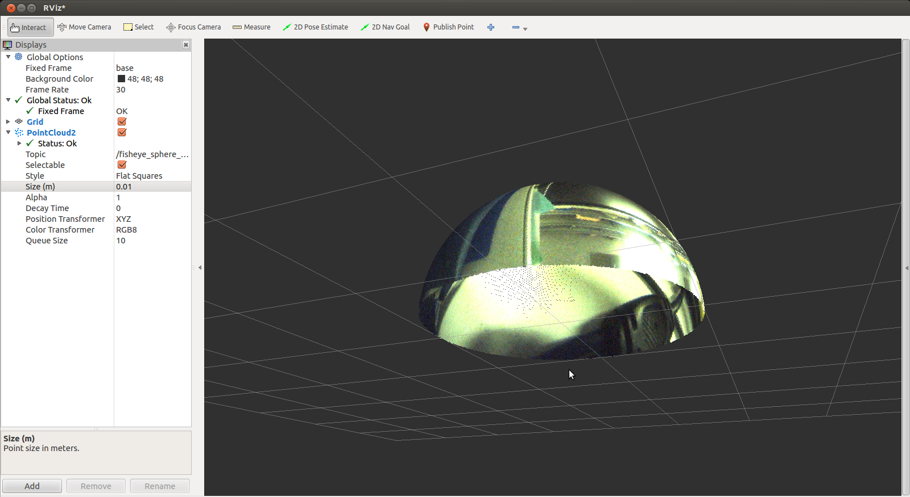

# FisheyeSpherePublisher

Show the sphere generated from fisheye image.
This was tested with Prosilica GC 2450C + nm30 lens

## Subscribing Topics
* `~input` (`sensor_msgs/Image`)
  Fisheye Image

## Publishing Topics
* `~output` (`sensor_msgs/PointCloud2`)

  Sphere pointcloud.

