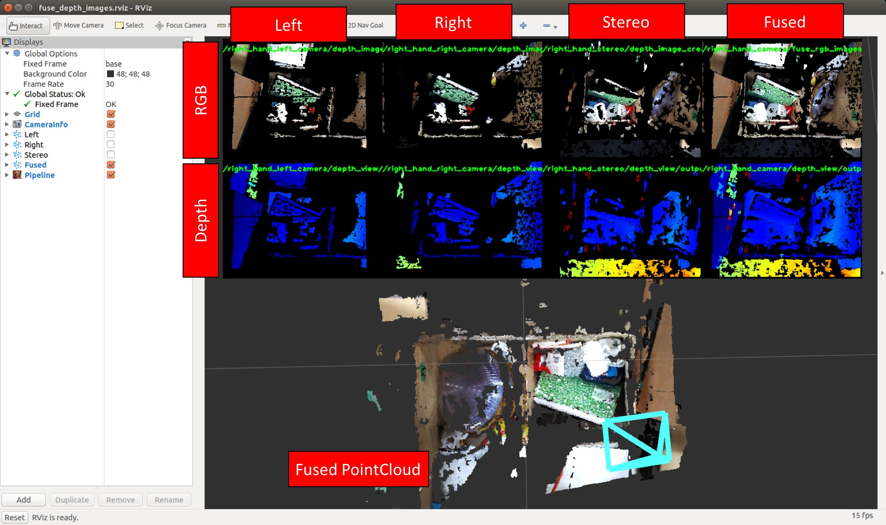

# FuseDepthImages



Do sensor fusions by multiple depth images ignoring nan region in each image.
For transformation of depth from one to another, you can use [jsk_pcl_ros/DepthImageCreator](./depth_image_creator.md).
See [sample_fuse_images.launch](https://github.com/jsk-ros-pkg/jsk_recognition/blob/master/jsk_pcl_ros/sample/sample_fuse_images.launch) for detail.

## Subscribing Topic

See rosparam `~input_topics`.


## Publishing Topic

* `~output` (`sensor_msgs/Image`)

  Output fused depth image.


## Parameters

**Required**

* `~input_topics` (String array, required)

  Input depth image topics.


**Optional**

* `~approximate_sync` (Boolean, default: `False`):

  Policy of synchronization, if `False` it synchronizes exactly, else approximately.

* `~queue_size` (Int, default: `100`):

  Queue size of topic msgs for synchronization.

* `~averaging` (Bool, default: `true`)

  Average image values while sensor fusion.

## Sample

```
roslaunch jsk_pcl_ros sample_fuse_images.launch
```
