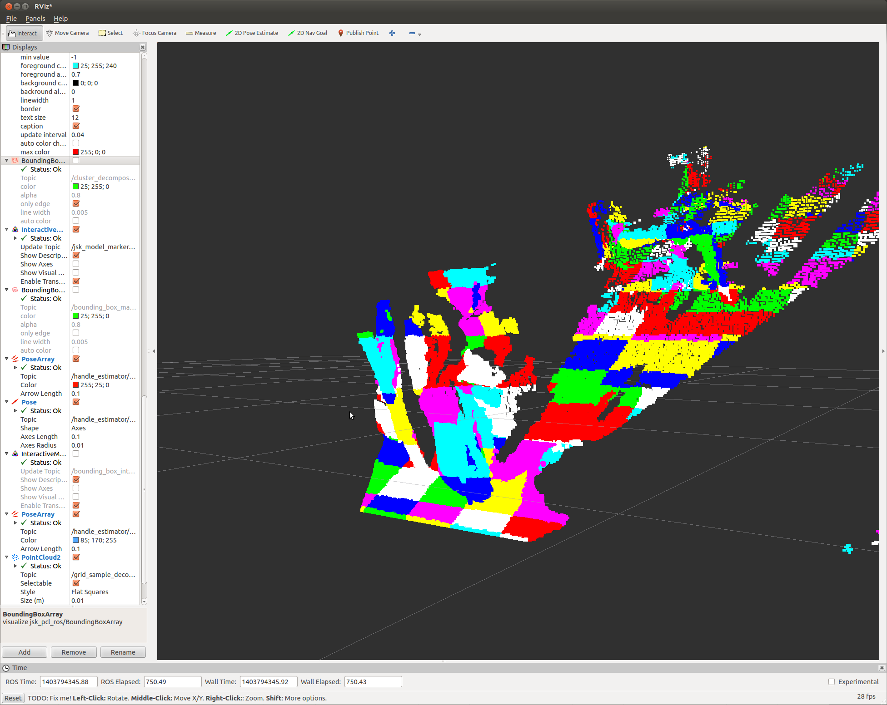

GridSampler
===========

What is this?
-------------

Sample clusters from point cloud with grid size.

Subscribing Topics
------------------

- ``~input`` (``sensor_msgs/PointCloud2``)

  Input point cloud.

Publishing Topics
-----------------

- ``~output`` (``jsk_recognition_msgs/ClusterPointindices``)

  Clusters of point indices which represent each grid sample.

Parameters
----------

- ``~grid_size`` (``Double``, default: ``0.2``)

  Grid size of each cluster in [m].

- ``~min_indices`` (``Int``, default: ``0``)

  Minimum number of point indices in each cluster.

Sample
------

.. code-block:: bash

  roslaunch jsk_pcl_ros sample_grid_sampler.launch
