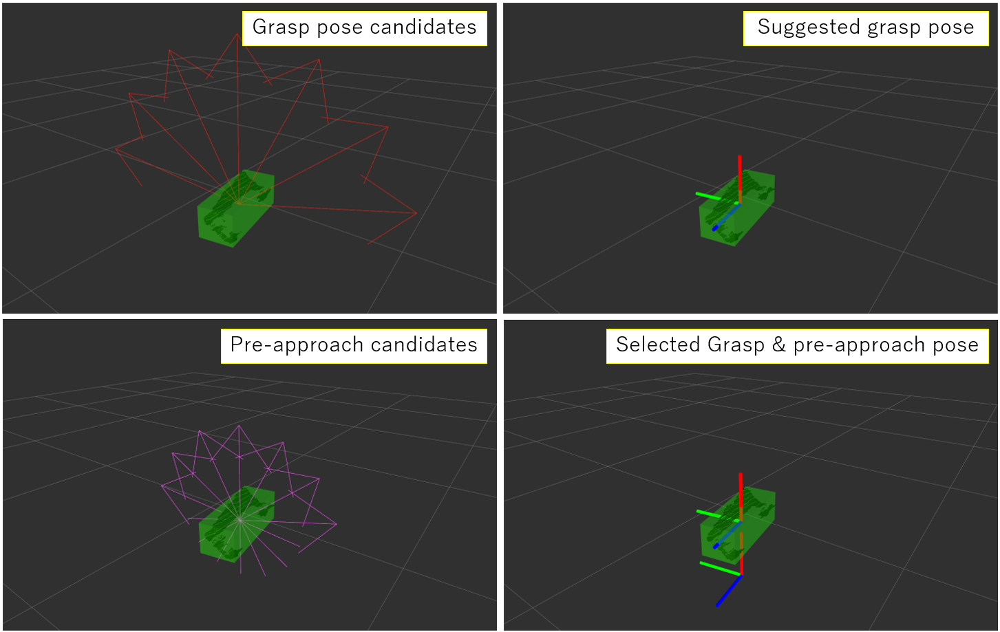

# HandleEstimator

## What Is This


Estimate 6-DOF grasp pose candidates using bounding box.

This node is similar to `jsk_pcl_ros/detect_graspable_poses_pcabase.py`, but the differences are ...

* Publish pre-approach pose or not.

* Candidates are the same position but different pose (former), or different position but the same pose (latter).

This node can also publish only selected pose.


## Subscribing Topic

* `~input` (`sensor_msgs/PointCloud2`)

  Input point cloud.

  Currently this topic is not used for estimation, but required.

  It must be synchronized with `~input_box`.

* `~input_box` (`jsk_recognition_msgs/BoundingBox`)

  Input bounding box.

  Dimensions of bounding box are used to estimate handle type internally.

  So it is recommended that the box is aligned to the object using PCA or so.

* `~selected_index` (`jsk_recognition_msgs/Int32Stamped`)

  Pose index chosen from indices of `~output` and `~output_preapproach`.


## Publishing Topic

* `~output` (`geometry_msgs/PoseArray`)

  Grasp pose candidates.

* `~output_preapproach` (`geometry_msgs/PoseArray`)

  Pre-approach poses of `~output`.

* `~output_best` (`geometry_msgs/PoseStamped`)

  Suggested best grasp pose chosen from `~output`.

* `~output_selected` (`geometry_msgs/PoseStamped`)

  Grasp pose selected by `~selected_index`.

* `~output_selected_preapproach` (`geometry_msgs/PoseStamped`)

  Pre-approach poses of `~output_selected_preapproach`.


## Parameter

* `~gripper_size` (Float, default: `0.08`)

  Gripper width of robot in meters.

  If all dimensions of input box are greater than this parameter, then the box will be estimated as ungraspable.

* `~approach_offset` (Float, default: `0.1`)

  Offset from grasp point in meters.

  This parameter is used for calculating `~output_preapproach`.

* `~angle_divide_num` (Int, default: `6`)

  Number of grasp pose candidates.


## Sample

```bash
roslaunch jsk_pcl_ros sample_handle_estimator.launch
```
