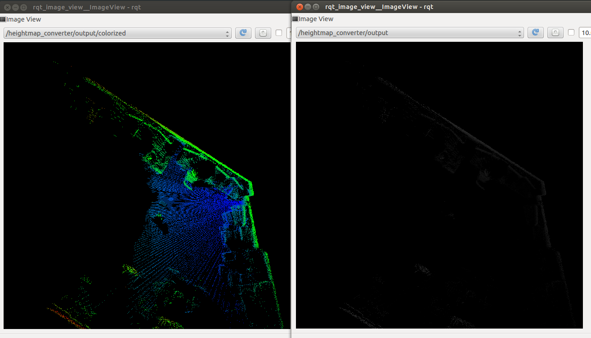

# HeightmapConverter


Convert a pointcloud(`sensor_msgs/PointCloud2`) into heightmap representation (`sensor_msgs/Image`).

## Subscribing Topic
* `~input` (`sensor_msgs/PointCloud2`)

  Input pointcloud

## Publishing Topic
* `~output` (`sensor_msgs/Image`)

  fields of the image is `CV_32FC2(float)`.
  Channel0 of the image represents heightmap and Channel1 of the image represents quality/intensity/reliability of value.
  If a pixel is not observed, it is filled by `-FLT_MAX`.

* `~output/config` (`jsk_recognition_msgs/HeightmapConfig`)

  Config topic.

## Parameters
* `~use_projected_center` (Bool, default: `False`)

  If true, `~fixed_frame_id`, `~center_frame_id` and `~projected_center_frame_id`
  will be enabled and heightmap will be created at `~center_frame_id`.

  If false, heightmap will be created at input point cloud frame.

* `~fixed_frame_id` (String, default: `map`)

  Parent frame ID of `~projected_center_frame_id`.

* `~center_frame_id` (String, default: `BODY`)

  Frame ID of center of output heightmap.

* `~projected_center_frame_id` (String, default: `BODY_on_map`)

  Name of new frame ID used in `~output`.

* `~resolution_x` (Integer, default: `400`)
* `~resolution_y` (Integer, default: `400`)

  Width and height of the output height map in pixels.

  These parameters can be changed by `dynamic_reconfigure`.

* `~min_x` (Double, default: `-2.0`)
* `~max_x` (Double, default: `2.0`)
* `~min_y` (Double, default: `-2.0`)
* `~max_y` (Double, default: `2.0`)

  Minimum and maximum value of heightmap dimension in meters.

  These parameters can be changed by `dynamic_reconfigure`.

* `~initial_probability` (Double, default: `1.0`)

  Initial value to be set to Channel1 of heightmap image

  This parameter can be changed by `dynamic_reconfigure`.

## Sample

```bash
roslaunch jsk_pcl_ros sample_heightmap_converter.launch
```
