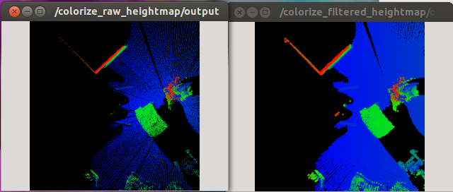

# HeightmapMorphologicalFiltering


Apply morphological filtering and average filter to fill small holes in pointcloud
which is represented as heightmap.

## Subscribing Topic
* `~input` (`sensor_msgs/Image`)

  Input heightmap. Hole should be represented as `-FLT_MAX` or `nan`.

  Encoding should be `32FC2`.

* `~input/config` (`jsk_recognition_msgs/HeightmapConfig`)

  Config topic.

  This topic name is automatically resolved by `~input` topic name.

## Publishing Topic
* `~output` (`sensor_msgs/Image`)

  Output heightmap.

* `~output/config` (`jsk_recognition_msgs/HeightmapConfig`)

  Config topic.

  This node just relays `~input/config`.

## Parameters
* `~max_queue_size` (Integer, default: `10`):

  Max queue size of subscription callback.
* `~mask_size` (Integer, default: `2`):

  Size of kernel operator of average filtering.
* `~max_variance` (Double, default: `0.1`):

  Allowable max variance in kernel operator
* `~smooth_method` (String, default: `average_variance`)

  You can choose method of smoothing from `average_variance` and `average_distance`.
* `~use_bilateral` (Bool, default: `false`)

  use bilateral filtering after smooth(interpolation) method
* `~bilateral_filter_size` (Integer, default: `5`)

  Kernel size of bilateral filtering.
* `~bilateral_sigma_color` (Double, default: `0.04`)

  filter sigma of color space.
* `~bilateral_sigma_space` (Double, default: `5`)

  filter sigma of coordinate space.

## Sample

```bash
roslaunch jsk_pcl_ros sample_heightmap_morphological_filtering.launch
```
